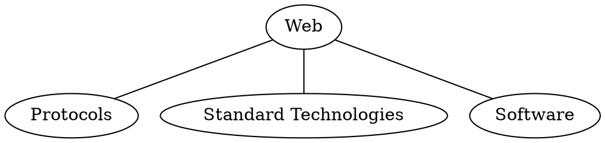
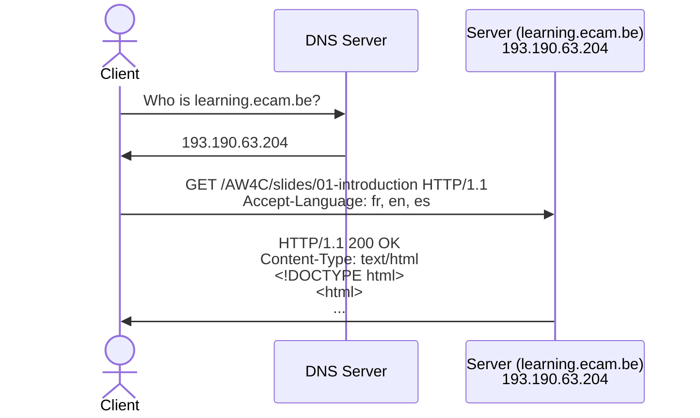
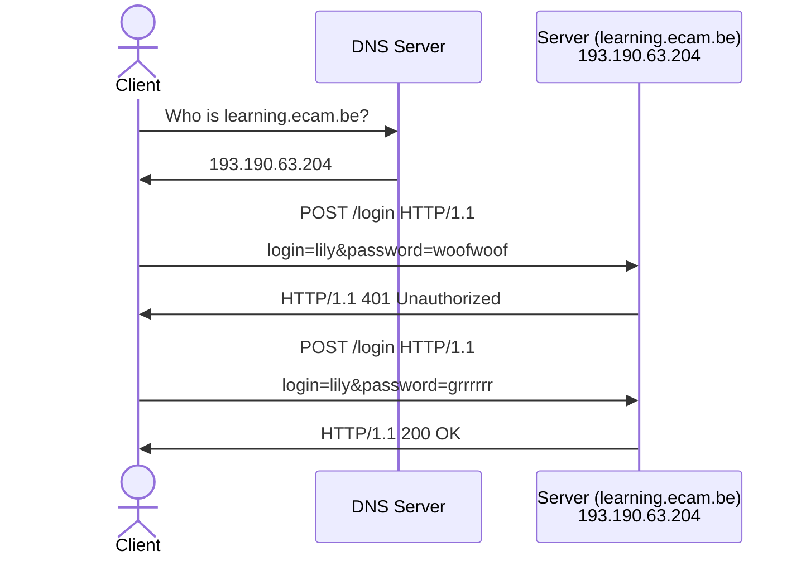
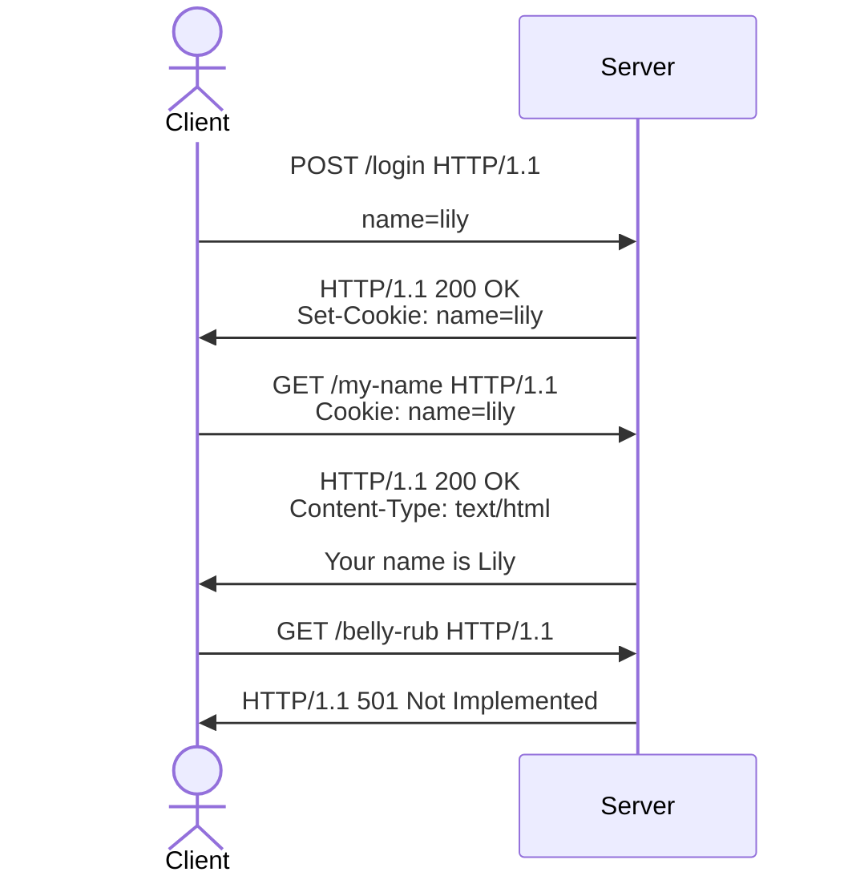
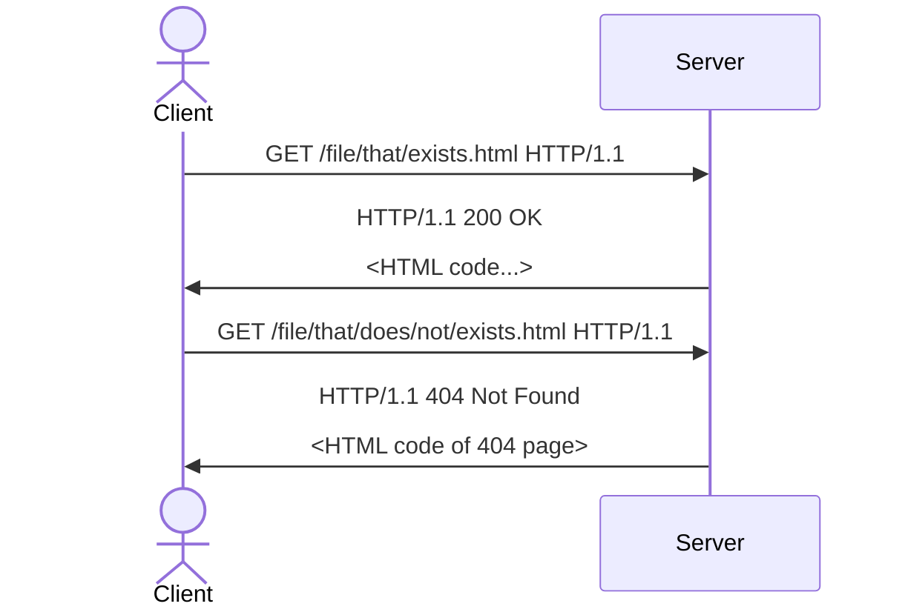

# Introduction {.w-1--2}

Course
: Web Architecture

Teachers
: 
 - Khoi NGUYEN (`NGY at ecam.be`)
 - Quentin LURKIN (`LUR at ecam.be`)

Teaching resources
: Everything will be published on https://learning.ecam.be

Work Load
: 6 credits

Language of Instruction
: English / French

Assessment
: 80% written exam, 20% project.

# Objectives {.w-1--2}

- Understand how the Web works and why it is so widely used

- Understand the main developments in its history
  (rise of the mobile phone, Single Page Applications, etc.)
  and their consequences on architecture.

- Be able to understand the advantages and the drawbacks
  of many current development patterns.

- Be able to build a simple web application
  adhering to current common best practices.

# What is the Web? {.w-1--2}

::: question
What is the (World Wide) Web?
:::

::: {.definition title="Web"}
System of interlinked hypertext documents and multimedia content accessible over the Internet (using web browsers).
:::

::: warning
The Web is a **service** operating over the Internet (= broader network infrastructure),
they are completely different things.
:::

# Web Infrastructure {.w-1--2}



1. Communication protocols:

   - HTTP/HTTPS
   - TCP/IP
   - DNS: Domain name to IP address

2. Standard Technologies:

   - HTML (structure of a document)
   - CSS (appearance of a document)
   - JavaScript (interactivity)

3. Software

   - Web clients (e.g. Chrome, Safari, Firefox, Internet Explorer, ...)
   - Web servers (e.g. NGINX, Apache, ...)

# DNS {.w-2--3 .flex .gap-12 .items-center}

~~~ yaml {.conversation to="DNS Server"}
- out: |
    Hey!
    I have a question for you.
    Who is *google.com*?
- in: |
    Hello.
    64.233.167.102
~~~

::: grow
### DNS

- *Domain Name Service*
- Aim: identify resources on networks
- Introduced in 1983
- Port 53

Roughly speaking, its aim is to translate a human friendly name (e.g. *google.com*)
to a more computer-friendly address (e.g. *64.223.167.102*).

Think of it as a *telephone directory* or the *Contact* application of your phone.
:::

# Client-Server Model {.w-1--2}


- **Client**: computer that requests a specific information
- **Server**: computer that provides that information

On the web, client-server communications follow the **HTTP** protocol
(HTTP: 80, HTTPS: 443).

# Client-Server Model {.w-1--2}

- Clients can access their data from multiple devices,
  as the server stores it for them.

- Servers can run incredibly complex and resource-hungry tasks on behalf of the clients (e.g. ChatGPT).

- Clients are completely at the mercy of servers,
  who have full control over the services and the data.

  - Subscription model (Office 365)
  - Vendor lock-in

# Intermission: class discussion {.w-1--2}

::: question
- A lot of crucial work is shifting from the client to the server,
  beyond the reach and the control of the client.

- The Internet started as a collection of decentralized open services (email),
  but newer services (e.g. messaging) are walled gardens (e.g. via patents, etc.).

Are these good or bad things (for clients, businesses, society, etc.)?
To what extent should we legislate to protects consumers?
:::

# HyperText Transfer Protocol {.w-1--2}

::: {.definition title="HTTP"}
HTTP is the structure used

- by Web clients to ask for resources,
- by Web servers to provide them.
:::

# HTTP (Client) Request {.w-1--2}

When a client (e.g. browser) contacts a server,
its communication follows rigidly the following format.

{.h-64 .mx-auto}

- **Method**: intention of the client
  - `GET`: **read** a resource
  - `POST`: **create** a resource
  - [Complete list](https://developer.mozilla.org/en-US/docs/Web/HTTP/Methods) of methods

- **Path**: what the client wants
- **Headers**: provide extra information about the client
- **Body** (optional, not on image): data (e.g. when using the `POST` method)

# HTTP (Server) Response {.w-1--2}

The server will reply according to the following format

{.h-64 .mx-auto}

- **Status**: indicates if an error has occured
- **Headers**: information (type, time of last modification, etc.)
- **Body**: content of the resource

::: hint
Use the Network Tab of your browser's Developer Tools to see the client/server communications.
:::

# HTTP: Response Status codes {.w-3--5}

::::: question
Can you think of any reason why it is important for a server to specify the correct status code?
:::::

{.mx-auto .w-72}

# HTTP is Stateless {.w-2--3 .flex .gap-12 .items-center}

~~~ yaml {.conversation to="Dory the Web Server"}
- out: Hey! My name is Merlin. What is my name?
- in: Hello. Your name is Merlin.
- out: What is my name?
- in: I don't know. You've never told me.
- out: Are you stupid?
- in: Why are you so mean?
- out: You're the best server in the world.
- in: Oh thank you, you're really nice.
~~~

::: grow
### Statelessness

According to the HTTP protocol,
every request should be understood in **isolation**.
The server will act as if it has forgotten your previous requests.

However, **web applications** are often **stateful**.

::::: question
- How does authentication work?
- Is it a good or a bad design decision?
:::::

{.h-72 .mx-auto}
:::

# Summary with sequence diagrams {.grid .grid-cols-2}

::::: column
### Example: read a page


:::::

::::: column
### Example: Login


:::::

# HTTP Cookie {.w-1--2}

::: question
- How does authentication work if HTTP is stateless?
- How can we customize the user's experience?
:::

::: definition
A cookie is a named block of data created at the server's request
and presented at every subsequent request until expiration.
:::

- The server asks for the creation of the cookie via the **Set-Cookie** header
- The client presents the cookie via the **Cookie** header.

*Useful analogy*: student card, loyalty cards

Note to self: show my github.com

# HTTP Cookie {.flex}

~~~ yaml {.conversation to="Web Server"}
- out: My name is Lily
- in: Here is the cookie with your name, use it with every request
- out: |
    Cookie: name=Lily

    What is my name?
- in: Your name is Lily
- out: |
    Cookie: name=Lily

    Belly rub?
- in: No, I don't know how to do that
~~~

::::: grow

:::::

# Cookie theft {.w-1--2}

{.w-96 .mx-auto}

::: warning
- Cookies are the only mechanism that makes the web stateful
- Cookies are just text stored on the client.
:::

- Client could just create cookies themselves without being asked by the server.
  How to check if the information is genuine?
- Simply by copying the cookie(s) of a victim,
  you can usurp their identity.

# Exercise: sequence diagrams {.w-1--2}

::: exercise
#. Draw a sequence diagram to explain how a website could implement a darkmode
   for their users.
#. Draw a sequence diagram of a user logging in to a website
   to access a private admin space.
:::

# HyperText Markup Language {.w-1--2}

{.h-72 .mx-auto}

::: definition
HTML is a markup language used for describing the content and structure of a web page.
:::

- Initial Release: 1993
- Filename extension: `.html`, `.htm`
- Open format
- Developed by [Tim Berners-Lee](https://en.wikipedia.org/wiki/Tim_Berners-Lee)

The Web browser parses the HTML to create the interface on the user's screen.

# Learn HTML {.w-1--2}

$$
\boxed{
\underbrace{\mathtt{<a}}_{\text{opening tag}}\
\overbrace{\mathtt{href}}^{\text{attribute}}
\mathtt{=}
\underbrace{\mathtt{"https://google.com"}}_{\text{value}}
\mathtt{>}
\overbrace{\mathtt{Google}}^{\text{child}}
\underbrace{\mathtt{</a>}}_{\text{closing tag}}
}
$$

The following resources are useful references.

- [HTML in 100 seconds](https://www.youtube.com/watch?v=ok-plXXHlWw)
- [Learn X in Y minutes: HTML](https://learnxinyminutes.com/html)
- [MDN Web Docs: HTML](https://developer.mozilla.org/en-US/docs/Web/HTML)

# HTML: demo

```html {.run .grid-cols-2 .grid .gap-12}
<header>
  <h1>Welcome to My Simple Web Page</h1>
</header>
<main>
  <p>
    This is a simple web page
    to demonstrate HTML structure and styling.
    Feel free to modify and expand it!
  </p>
  <ul>
      <li>Item 1</li>
      <li>Item 2</li>
      <li>Item 3</li>
  </ul>
  <p>
    Go to
    <a href="other.html">another page</a>.
  </p>
</main>
<footer>
  &copy; 2025 My Simple Web Page
</footer>
```

# Cascading Style Sheets {.w-1--2}

{.mx-auto .w-72}

::: definition
CSS is used for describing the presentation and style of a web page.
:::

- Initial release: 1996
- Filename extension: `.css`
- Open format

# Learn CSS

The following resources are useful references.

- [CSS in 100 seconds](https://www.youtube.com/watch?v=ok-plXXHlWw)
- [Learn X in Y minutes: CSS](https://www.youtube.com/watch?v=OEV8gMkCHXQ)
- [MDN Web Docs: CSS](https://developer.mozilla.org/en-US/docs/Web/CSS)

# CSS: demo

```html {.run .grid .grid-cols-2 .gap-12}
<h1>This is a title</h1>
<p>This is a paragraph</p>

<style>
  h1 {
    font-variant: small-caps;
  }
  p {
    color: red;
  }
</style>
```

# DOM {.w-1--2}

::: {.definition title="DOM"}
The DOM is the representation of a web page in the working memory of the browser.
:::

A web page is represented as a tree.

{.w-1--2 .mx-auto}

# JavaScript {.w-1--2}

{.w-96 .mx-auto}

::: definition
JavaScript is a **programming language** (like Python, PHP, etc.)
which has the particularity that it can run in the browser and manipulate the DOM.
:::

- Appeared in 1995
- Filename extension: `.js`
- 99% of Websites use client-side JavaScript

# JavaScript: DOM manipulations

In particular, JavaScript makes pages **interactive**.

```html {.run .grid-cols-2 .grid .gap-12}
<!-- Uncommenting the next line will break the code -->
<!-- <input style="display: none" /> -->
<p>Quel est ton nom?</p>
<label>Nom: <input /></label>
<p>Bonjour <span id="name"></span></p>

<script>
  // Select DOM nodes
  const input = document.getElementsByTagName('input')[0]
  const name = document.getElementById('name')

  function getNameFromInput() {
    name.innerText = input.value
  }

  input.addEventListener('input', getNameFromInput)
</script>
```

# Static website {.w-1--2}

A static website works kind of like a file explorer.



::: remark
- It works for other extensions
- Folders such as `/folder/` display `/folder/index.html`
:::