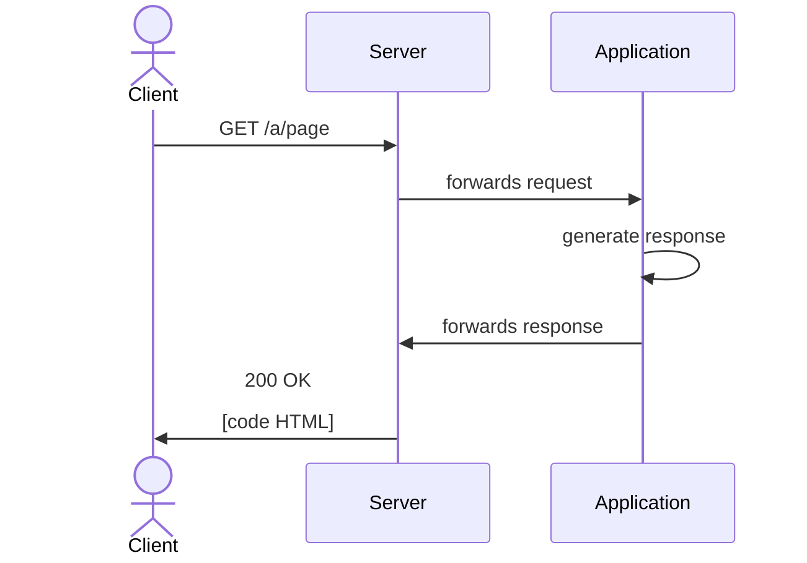

# Outline {.w-1--2}

- Multiple-Page Applications

- API

- Databases

- Authentication

# Multiple-Page applications: characteristics {.w-1--2}

- Requests are sent when clicking a link,
  or when submitting a form.

- When a response is received,
  the browser builds the DOM from scratch
  and the memory is cleared.

# Examples {.w-1--2}

::: example
MPAs are particularly suited to **content-driven** websites.
:::

- Wikipedia

- News website

- E-commerce

- Wordpress

- Blogs

# Exercise: is it an MPA? {.w-1--2}

::: exercise
Are the following sites MPAs?

- https://youtube.com
- https://learning.ecam.be
- https://amazon.com
- https://rtbf.be
- https://draw.io
- https://instagram.com
- https://vrt.be
:::

# How does it work? {.w-1--2}

::: question
How does an MPA work?
:::

A program intercepts the request
and generates the response programmatically.
The generated page can depend on:

- the URL (including the **query string**)

  

- the request headers (such as **cookies**)

- the request body (e.g. **form data**)

DEMO with PHP.

# Sequence diagram



# Advantages

- SEO-friendly

- Accessibility

- Fast, performant on low-end devices

- Easier to maintain

- Stable ecosystem

- Use native browser features (e.g. cache, history, etc.)

# Drawbacks {.w-1--2}

- JavaScript code is (e.g. analytics) re-evaluated on every navigation

- Some UX features are simply impossible

- Slower feedback to the user

# Towards APIs {.w-1--2}

In a lot of use cases,
the following reasons would make us move away
from traditional MPAs.

- Need for asynchronous operations

- Need to serve different types of clients

# Back-end API {.w-1--2}

::: definition
A server-side web API consists of one or more publicly exposed endpoints to a defined request–response message system, typically expressed in JSON or XML by means of an HTTP-based web server.
:::

::: question
Why use APIs?
:::

# API Example: PokeAPI {.w-1--2}

<Iframe src="https://pokeapi.co/" class="w-full h-full" />

# Consuming an API

```html {.run .grid-cols-2 .grid .gap-12}
<p><input id="input" /></p>
<p></p>

<script>
  const input = document.getElementById('input')
  const img = document.getElementById('img')

  input.oninput = (event) => {
    loadPokemonImage(event.target.value)
  }

  async function loadPokemonImage(name) {
    const url = 'https://pokeapi.co/api/v2/pokemon/'
    try {
      const res = await fetch(url + name)
      const data = await res.json()
      img.src = data.sprites.other['official-artwork']['front_default']
    } catch {
      img.src = 'https://raw.githubusercontent.com/n3r4zzurr0/svg-spinners/refs/heads/main/svg-css/270-ring-with-bg.svg'
    }
  }
</script>
```