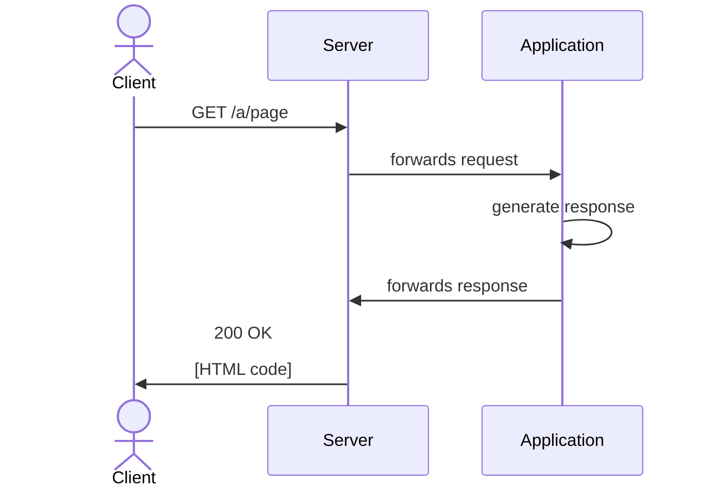
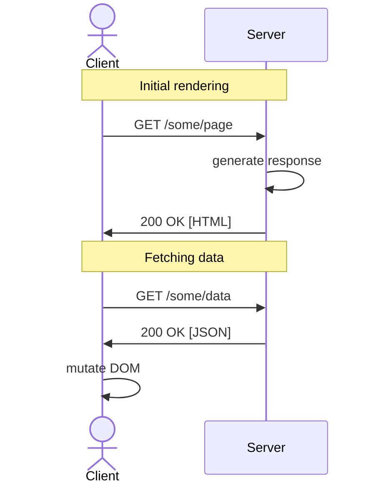

# Chapter Outline {.w-1--2}

- Multiple-Page Applications

- Rise of mobile phones

- More demanding UX needs

- DX improvements: React

# Multiple-Page applications: characteristics {.w-1--2}

- Requests are sent when clicking a link,
  or when submitting a form.

- When a response is received,
  the browser builds the DOM from scratch
  and the memory is cleared.

- Little interactivity

::: warning
Some websites might look like MPAs
but might not be (e.g. this website).
:::

# Examples {.w-1--2}

::: example
MPAs are particularly suited to **content-driven** websites.
:::

- Wikipedia

- News website

- E-commerce

- Wordpress

- Blogs

# Exercise: is it an MPA? {.w-1--2}

::: exercise
Are the following sites MPAs?

- https://youtube.com
- https://learning.ecam.be
- https://amazon.com
- https://rtbf.be
- https://draw.io
- https://instagram.com
- https://vrt.be
:::

# How does it work? {.w-1--2}

::: question
How does an MPA work?
:::

A program intercepts the request
and generates the response programmatically.
The generated page can depend on:

- the URL (including the **query string**)

  

- the request headers (such as **cookies**)

- the request body (e.g. **form data**)

DEMO with PHP.

# Sequence diagram



# Advantages

- SEO-friendly

- Accessibility

- Fast, performant on low-end devices

- Easier to maintain

- Stable ecosystem

- Use native browser features (e.g. cache, history, etc.)

# Drawbacks {.w-1--2}

- JavaScript code is (e.g. analytics) re-evaluated on every navigation

- Some UX features are simply impossible (messaging, infinite scroll, etc.)

- Slower feedback to the user (requires full page reloads)

- Uses more data

# UX and mobile apps {.w-1--2}

In a lot of use cases,
the following reasons would make us move away
from traditional MPAs.

- Need for asynchronous operations (UX) (e.g. messaging)

- Need to serve different types of clients (e.g. mobile).

# Mobile clients {.w-1--2}

- Limited computing capabilities (RAM, CPU, Battery)

- Limited input/output capabilities (Tactile, Screen Size)

- Unreliable internet connection

::: question
What if clients only downloaded data instead of the whole page?
:::

Two directions are still possible:

- No application or Web application

- Native application

# Mobile: HTML or native? {.w-1--2}

> The biggest mistake we made as a company was betting too much on HTML5 as opposed to native…
> because it just wasn’t there.
> And it’s not that HTML5 is bad.
> I’m actually, on long-term, really excited about it.
> One of the things that’s interesting is we actually have more people on a daily basis using mobile Web Facebook
> than we have using our iOS or Android apps combined.
> So mobile Web is a big thing for us.

(Mark Zuckerberg)

# Back-end API {.w-1--2}

::: definition
A server-side web API consists of one or more publicly exposed endpoints to a defined request–response message system,
typically expressed in JSON or XML by means of an HTTP-based web server.
:::

::: question
Why use APIs?
:::

# JSON {.grid .grid-cols-2}

<Iframe src="https://learnxinyminutes.com/json/" class="w-full h-full" />

# API Example: PokeAPI {.w-1--2}

<Iframe src="https://pokeapi.co/" class="w-full h-full" />

# API Example: Postman

<Iframe src="https://jsonplaceholder.typicode.com/" class="w-full h-full" />

# AJAX {.w-1--2}

::: {.definition title="AJAX"}
Set of development techniques to create asynchronous web applications.
:::

In practice nowadays,
we use JavaScript's `fetch` to make requests after certain events:

::: example
- Infinite scroll (sends `GET` requests when you scroll)

- Messaging (sends a `POST` request when pressing ENTER)
:::

# Consuming an API: AJAX



# Consuming an API: AJAX

```html {.run .grid-cols-2 .grid .gap-12}
<!-- Initial rendering -->
<p><input id="input" /></p>
<p></p>

<!-- Mutations -->
<script>
  const input = document.getElementById('input')
  const img = document.getElementById('img')

  input.oninput = (event) => {
    loadPokemonImage(event.target.value)
  }

  async function loadPokemonImage(name) {
    const url = 'https://pokeapi.co/api/v2/pokemon/'
    try {
      const res = await fetch(url + name)
      const data = await res.json()
      img.src = data.sprites.other['official-artwork']['front_default']
    } catch {
      img.src = 'https://raw.githubusercontent.com/n3r4zzurr0/svg-spinners/refs/heads/main/svg-css/270-ring-with-bg.svg'
    }
  }
</script>
```

# Mutations are hard {.w-1--2}

AJAX shifts the rendering from server to client.

- HTML is **declarative**

- JavaScript is **imperative** and **event-driven**,
  (the way we think about UI is **state-driven**)

AJAX shifts the rendering from the server (which renders **HTML**)
to the client, who has to **mutate the DOM** with JavaScript.

::: remark
Around that time (around 2013),
dealing with DOM mutations was thought to be the hardest problem in web development.
:::

# Imperative programming {.grid .grid-cols-2}

::::: col
```html {.run}
<style>
  .error { color: red; }
  .valid { color: green; }
</style>
<label>
  Email: <input id="email" />
</label>
<p id="feedback">
</p>

<script>
  const input = document.getElementById('email')
  const feedback = document.getElementById('feedback')
  input.oninput = function() {
    const email = input.value
    const valid = email.includes('@ecam.be')
    if (email && valid) {
      feedback.className = 'valid'
      feedback.innerHTML = 'Your email is ' + email
    } else if (email) {
      feedback.className = 'error'
      feedback.innerHTML = "\
        The email you've entered\
        is not a valid ECAM email address\
      "
    } else {
      feedback.className = ''
      feedback.innerHTML = ''
    }
  }
</script>
```
:::::

::::: col
- Line 14, we listen to the user's input.
  The logic of the code is **event-driven**.

- Lines 18-25:
  we mutate the paragraph meant for user feedback.
  This is **imperative** code,
  it tells us what to do.

> When something happens,
> do exactly these things
:::::

# React {.w-1--2}

{.w-96 .mx-auto}

- Original author: Jordan Walke (Facebook)
- Initial release: 2013
- Written in: JavaScript
- License: MIT (Open-Source)

> Wouldn't it be easier, if anything happened,
> we blow away the entire UI
> and start from scratch?

# React documentary

<Youtube src="https://www.youtube.com/watch?v=8pDqJVdNa44" class="mx-auto" zoom={2} />

# React {.w-1--2}

::: question
What is React?
:::

In a nutshell,
React allows to **declaratively** create **reusable components** ($\approx$ HTML tags).

```javascript
<Slideshow>
  <Slide title="React">
    <Question>
      <p>What is React?</p>
    </Question>
    <p>
      In a nutshell,
      React allows to <strong>declaratively</strong>
      create...
    </p>
  </Slide>
</Slideshow>
```

These **components** describe bits of UI,
and are a mixture of HTML, JavaScript, and CSS.

Virtually all frameworks/UI librairies have since copied that approach from React.

# JavaScript frameworks {.w-1--2}

::: question
Why use a JavaScript framework?
:::

- **Declarative** and **state-driven**

- **Reusability**

- **Encapsulation**

- **Testability**

# Example: Svelte's declarative syntax {.grid .grid-cols-2}

::::: col
```javascript {.run framework=svelte}
<script>
  let email = $state('')
  let valid = $derived(email.includes('@ecam.be'))
</script>

<label>
  Email: <input type="text" bind:value={email} />
</label>

{#if email && valid}
  <p class="valid">Your email is {email}.</p>
{:else if email}
  <p class="error">
    The email you've entered
    is not a valid ECAM email address.
  </p>
{/if}

<style>
  .error { color: red; }
  .valid { color: green; }
</style>
```
:::::

::::: col
- **Declarative**: this is a **description** of what the UI should look like,
  it is **valid at any point in time**.

- **State-driven**: the state (here the email) dictates
  whath the UI should look like.

> If the state is ...,
> here is what the UI should be.

### Comments about Svelte

- Line 2:
  we declare `email` to be a **state variable**,
  which means it could trigger UI changes.

- Line 3:
  we declare `valid` to be a **derived value**,
  which means its value should be **recalculated**
  every time the dependent state changes
  (think Excel).

- Line 7:
  we bind the input value to `email`.
  If one changes, the other follows.

DEMO: pokedex
:::::

# Summary

The following will lead to a considerable shift
in web architecture

#. More demanding UX needs

   - Need for immediate feedback
   - Want the page to be 'alive' instead of a full reload

#. Rise of mobile phones

   - Mobile first
   - Less performant, less reliable internet connection
   - Data/markup separation $\implies$ API
  
#. Considerable DX Improvements

   Cheaper and easier to make pages highly interactive.

# What's next? {.grid .grid-cols-2}


::: col
We'll get to 2016...
:::