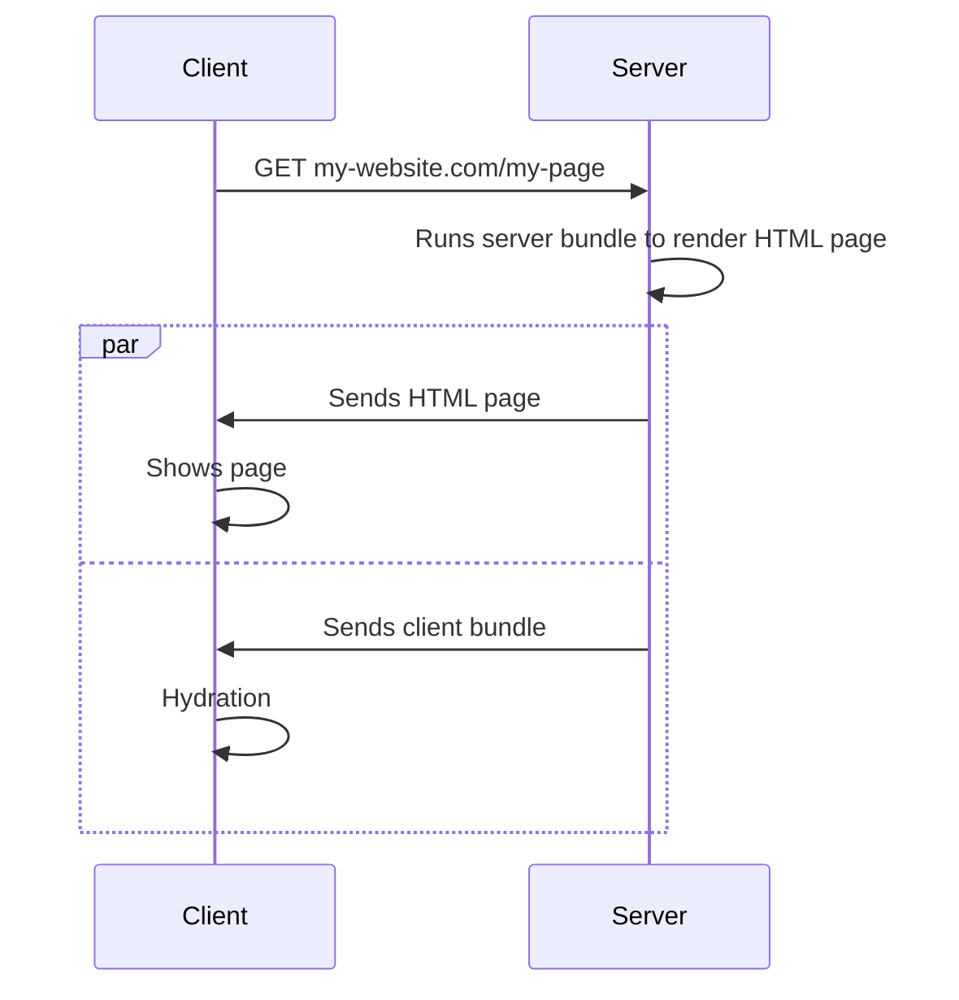

# Summary {.w-1--2}

#. Full page reloads are slow and use data/battery

#. Application State is lost at every page load $\implies$ bad UX

#. Rise of mobile $\implies$ markup/data separation $\implies$ API.

#. Web: API $\Longleftrightarrow$ AJAX

#. AJAX is hard in 'vanilla' JavaScript

#. **Components architecture** (React, Vue, Angular, Svelte)

   - DX is better than ever
   - AJAX is easy
   - Rendering is done client-side

# Recall: AJAX {.w-1--2}

::: definition
AJAX is a programming pattern in which web pages change their content dynamically
without reloading the entire page
by making requests to an API.
:::

Single-Page Applications push that idea to the extreme:
never reload the page,
never break the client's state.

# A bit more about components {.w-1--2}

Components are pieces of UI.
They are written **declaratively** and are **state-driven**.

- **state**: variables whose values impact the UI.

- **derived values**: variables directly dependent on state.
  Must be updated as soon as state changes.

- **effects**: action performed following a state changes.

DOM mutations are effects,
but need not implementing in a declarative pattern.

# A bit more about components {.w-1--2}

```html
<Page>
  <Navbar />
  <Blog />
  <Footer />
</Page>
```

- Components are isolated elements with their own behaviour (e.g. AJAX data fetching),
  and they render at different moments.

- The browser will render `Page`, then `Navbar`, `Blog` and `Footer`.

- When rendered, they might fetch their own data!

In short, the components architecture might lead to many more round-trips between client and server.
They are called **waterfalls**.

# Single-Page Application {.w-1--2}

- Single entry point

- Extreme use of AJAX

- Navigation is faked (client-side routing)

::: question
Why do we do this?
:::

- Better UX

- Faster after the initial load

- SPAs work naturally with APIs

- Excellent DX

- Because we can...

# Single-entry point {.grid .grid-cols-2}

```python
from fastapi import FastAPI
from fastapi.staticfiles import StaticFiles
from fastapi.responses import FileResponse

app = FastAPI()

app.mount("/static", StaticFiles(directory="static"), name="static")

@app.get("/{full_path:path}")
async def serve_spa(full_path: str):
    return FileResponse("static/index.html")
```

::::: col
On the left-hand side is an example
of a server configuration with a **single entry point** in Python (FastAPI).

- All files in `static` are served as is,
  e.g. `/static/main.css` will point to `static/main.css`

- All other routes are redirected to the `static/index.html`.
  Traditionally, routing happens on the client,
  but this time, we delegate it to the page to handle it.
:::::

# Client-Side Routing {.grid .grid-cols-2}

::::: col
The SPA uses `window.location.pathname` to get the actual webpage:

```html
<div id="app">
</div>

<script>
  const content = document.getElementById('app')

  function render(page) {
    if (page === '/about') {
        content.innerHTML = '<h1>About page</h1>'
    } else if (page === '/') {
        content.innerHTML = '<h1>Home</h1>'
    } else {
        content.innerHTML = '<h1>404 Not Found</h1>'
    }
  }

  render(window.location.pathname)
</script>
```
:::::

::::: col
- The page is **initially empty** (CEO!)

- The browser takes care of **routing** and of **rendering**,
  tasks that used to be done on the server.
:::::

# Single-Page application: initial rendering {.w-1--2}


::: definition
The multiple return trips between client and server are called a 'waterfall'.
They are a direct consequence of the **components architecture**.
:::

# Client-Side Routing: navigation {.grid .grid-cols-2}

```html
<script>
  document.querySelectorAll('a').forEach(link => {
    link.addEventListener('click', function(event) {
      event.preventDefault()
      const path = link.getAttribute('href')
      history.pushState({ path }, '', path)
      render(path)
    })
  })
</script>
```

::::: col
- Goes through all the links to...

  - Disable their default behaviour (load another page)
  - Add the new page in the history navigation and change the current URL
    **without** asking for a page reload.
  - Render the content associated with the new URL.

```javascript
history.pushState(state, unused, url)
```

- `state`: other information you might want to store,
  (e.g. cursor position, etc.).
  This may be restored when navigating back to the page.
- `unused`: deprecated argument...
- `url`: the address of the new page
:::::

# Example: scroll position {.grid .grid-cols-2}

```html
<script>
  document.querySelectorAll('a').forEach(link => {
    link.addEventListener('click', function(event) => {
      event.preventDefault()
      const path = link.getAttribute('href')
      const position = window.scrollY;
      history.pushState({ path, position }, '', path)
      render(path)
    })
  })

  window.onpopstate = function (event) {
    if (event.state) {
      window.scrollTo(0, event.state.position)
    }
  }
</script>
```

::::: col
- We push the scroll position in the state in the history stack

- When pressing back or forward,
  `popstate` is triggered,
  and we can access the state of that history entry
  to restore the scroll position.
:::::

# Sequence diagram: navigation


# Client-Side routing {.w-1--2}

::: question
Why fake navigation?
:::

The URL can contain state information that could be persisted
across page refreshes.

::: example
- On Messenger/instagram, reloading the page while chatting to someone restores the state.
- Try it on WhatsApp Web
:::

# Exercise: WayBack machine {.grid .grid-cols-2}


::::: col
1. Go to https://web.archive.org/

2. Look up https://www.instagram.com/kimkardashian/

3. Try a date such as 11 November 2016

::: question
WayBack Machine provides an exact snapshot of a web page over time.
In theory, as the code is exactly the same,
the page should be displayed the same.

Why is the page blank?
Was Instagram down?
:::
:::::

# Single-Page Applications: advantages {.w-1--2}

- Better UX
  - Real-time data updates
  - State preservation
  - Instant feedback and rich interactivity
    (e.g. form validation, drag and drop, infinite scrolling, etc.)
  - Enhanced mobile experience (push notifications for PWA)

- Improved performance after first load

- Reduced server load and data usage

# SEO

For SPAs without SSR (later),
SEO is challenging.

- Content rendering is delayed

- Difficult url/content association

- Crawling dynamic content

# Security implications

- If SPAs are more difficult to index,
  they are more difficult to analyse for security issues.

- The more interactive a website is,
  the more vulnerabilities it can have.

# Data fetching with SPA {.w-1--2}

**Server state** is extremely difficult to manage.

- Race conditions (responses can have unpredictable order)

- Deduping multiple requests

- Caching

- Updating out-of-date data

# Isomorphic applications and SSR {.w-1--2}

::: question
SPAs and MPAs both have their advantages.
What if we wanted the best of both worlds?
:::

::: hint
Write an SPA and an MPA with a **single codebase**.
This naturally requires the use of JavaScript on both sides.
Such applications are called **isomorphic**.
:::

A bundler will then transform that **single codebase** into **two bundles**:
one for the client and one for the server.

- the **server bundle** will be used
  to prerender HTML pages (MPA) and handle API requests.

- the **client bundle** will be used to
  transform the page into a Single Page App (hydration),
  and handle interactivity.

# Vocabulary {.w-1--2}

Isomorphic/universal application
: A web app that is written as a single codebase
  that will be bundled/compiled into two code bases:
  one for the browser (client bundle) and one for the server.

Server Side Rendering (SSR)
: Use the browser bundle to generate a noninteractive,
  purely HTML version of the requested page.

Hydration
: Process during which the noninteractive page
  becomes interactive (and even an SPA).

::: remark
The difference between **isomorphic apps** and **Single-Page applications**
is that the first page is first **Server Side Rendered** and then **hydrated**.
Afterwards, it is an SPA.
:::

# Components {.w-3--5}

In practice, isomorphic apps use a framework that extends a client-only framework/library
(e.g. SvelteKit is based on Svelte, Next.js is based on React, Nuxt is based on Vue).
These frameworks often use an HTML-like syntax to create UI components:

Components are a crucial ingredient of isomorphic apps
and are a good example of
how a **single codebase** can be interpreted completely differently depending on the runtime.

::: {.grid .grid-cols-2 .text-sm}
:::: col
### JSX (React)

```jsx
function Counter() {
  const [count, setCount] = useState(0)
  return (
    <button onClick={() => setCount(count + 1)}>
      Count: {count}
    </button>
  )
}
```
::::
:::: col
### Single File Components (Vue, Svelte)

``` html
<template>
  <button @click="count++">Count: {{ count }}</button>
</template>

<script setup>
import { ref } from 'vue';

const count = ref(0);
</script>
```
::::
:::

- In the **browser bundle**,
  this custom syntax will simply compile to HTML.

- For the **client bundle**,
  this custom syntax will compile to (virtual) DOM operations.

# Sequence diagram {.columns-2}



::: {.exercise title="Exam-type question"}
A visitor goes on website.com and clicks on the link that leads to `/about`.
Write a sequence diagram of the client-browser interaction if the link click happens

a. before hydration finishes
b. after hydration finishes
:::

# Advantages {.w-1--2}

- Fast noninteractive first render (content painted): good for SEO

- Fast navigation after the page becomes interactive

- All the advantages of an SPA

- Sharing code between front-end and backend


# Drawbacks {.w-1--2}

- Hydration

  - Page painted but doesn't work at the beginning
  - Content is painted faster, but it's harder to hydrate.
    Page will take more time to be fully interactive.

- More code

- Forces the use of JavaScript for the server

- Like SPAs, very susceptible to waterfalls.

- Security: blurry network boundary