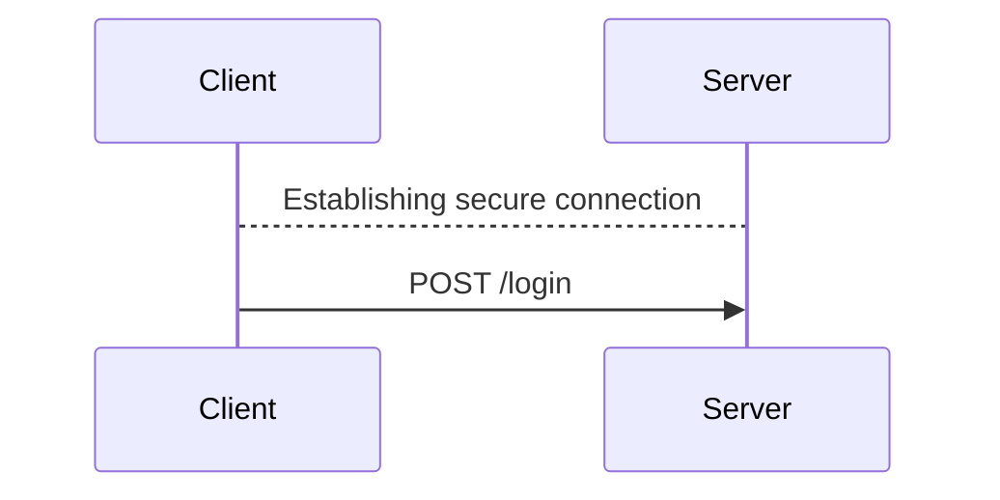
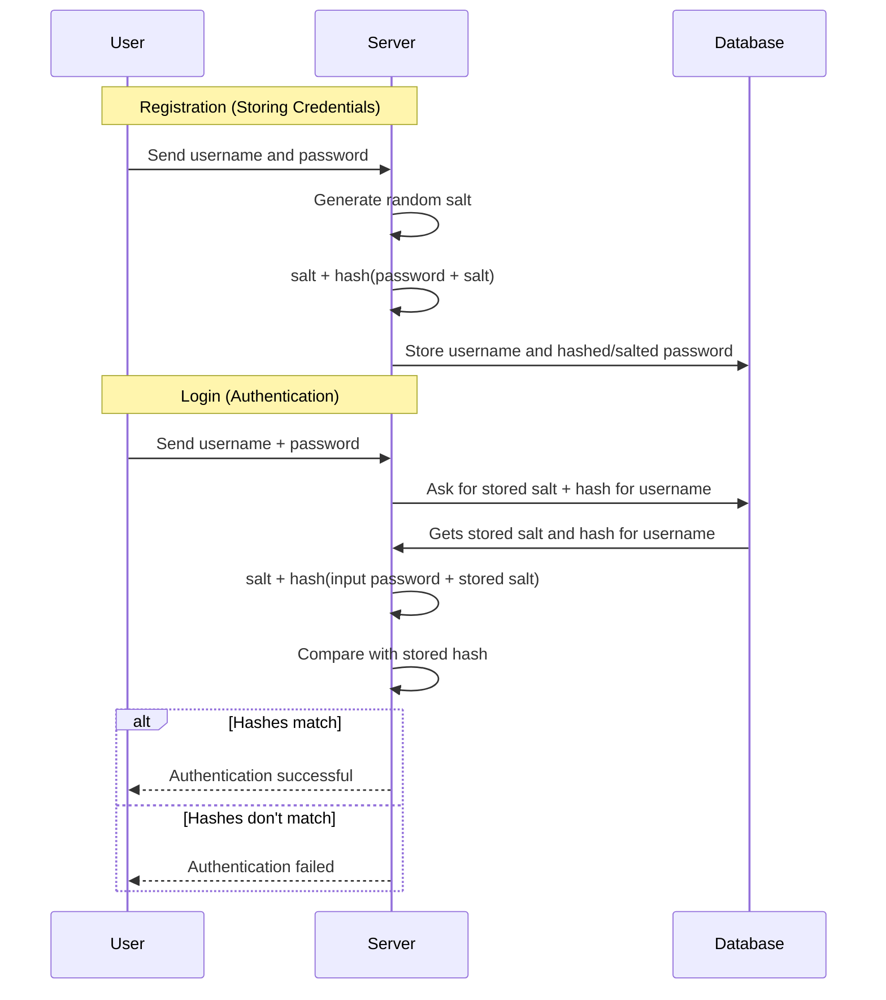
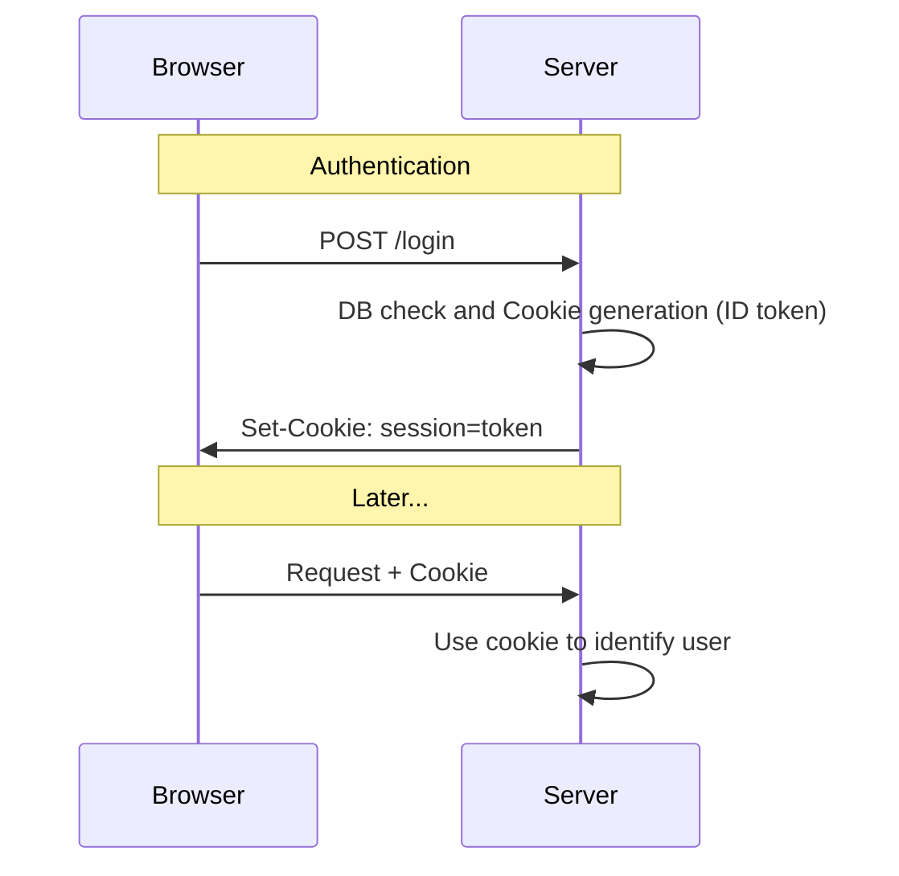

# Authentication vs Authorization

# Authentication issues {.w-1--2}

- How can you send the password to the server
  in such a way no one else can read it?

- How do we safely store the passwords in the database,
  so that if the latter is compromised,
  the users are still safe.

- As sessions are persisted by cookies that are saved on the client,
  how do you make sure they cannot be faked by the user?

- How do SSO and OAuth work?

# HTTPS {.w-1--2}

::: question
How can you send the password to the server
in such a way no one else can read it?
:::

Remember that HTTP communications use plain text.

Using HTTP**S** = HTTP + TLS (but formerly SSL).



# Storing passwords {.w-1--2}

::: question
How do we safely store the passwords in the database,
so that if the latter is compromised,
the users are still safe.
:::

Any ideas?

# Hashing {.w-1--2}

::: example
```{.js .run tailwind=true framework="solid" runImmediately=true hideEditor=true}
import { createSignal, createResource } from 'solid-js'

async function sha256(message: string) {
  const msgBuffer = new TextEncoder().encode(message)
  const hashBuffer = await crypto.subtle.digest('SHA-256', msgBuffer)
  const hashArray = Array.from(new Uint8Array(hashBuffer))
  const hashHex = hashArray.map((b) => b.toString(16).padStart(2, '0')).join('')
  return hashHex
}

function App() {
  const [string, setString] = createSignal('Bonjour')
  const [hashed] = createResource(string, (str) => sha256(str))
  return (
    <div class="text-2xl">
      <label>
        String: <input class="border p-2" onInput={(e) => setString(e.target.value)} value={string()} />
      </label>
      <p>
        Hash:{' '}
        <code>
          <small class="clickable">{hashed()}</small>
        </code>
      </p>
    </div>
  )
}
```
:::

::: question
What are the properties of hashing,
and what makes it more suitable than encryption for storing passwords?
:::

# Collisions {.w-1--2}

As hashes have the same number of characters
(e.g. $64$ characters for sha256),
this means that **collisions are possible**.

::: definition
A collision happens when two distinct strings have the
same hashes.
:::

<Calculator />

::: question
Is it easy to find a collision?
:::

# Is hashing enough? {.w-1--2}

::: example
This is an example of a table containing users and hashed passwords.

```{.js .run tailwind=true framework="solid" runImmediately=true hideEditor=true}
import { createSignal, createResource } from 'solid-js'

const info = [
  { login: 'tuxie', password: 'hello' },
  { login: 'lily', password: 'snake' },
  { login: 'choco', password: 'hello' },
  { login: 'bacon', password: 'hello' },
  { login: 'emma', password: 'ilovetuxie' },
]

async function sha256(message: string) {
  const msgBuffer = new TextEncoder().encode(message)
  const hashBuffer = await crypto.subtle.digest('SHA-256', msgBuffer)
  const hashArray = Array.from(new Uint8Array(hashBuffer))
  const hashHex = hashArray.map((b) => b.toString(16).padStart(2, '0')).join('')
  return hashHex
}

function App() {
  const [users] = createResource(() => {
    return Promise.all(
      info.map(async (u) => ({...u, password: await sha256(u.password) }))
    )
  })
  return (
    <>
      <table>
        <thead>
          <tr>
            <th>Login</th>
            <th>Passwords</th>
          </tr>
        </thead>
        <tbody>
          {users()?.map(u => (
            <tr>
              <td class="px-2 py">{u.login}</td>
              <td class="px-2 py"><code>{u.password}</code></td>
            </tr>
          ))}
        </tbody>
      </table>
    </>
  )
}
```
:::

::: question
What do you observe?
:::

# Rainbow tables {.w-1--2}

::: definition
Precalculated table containing the hash of many passwords
:::

::: question
How can we prevent such attacks?
:::

# Salting {.w-1--2}

::: definition
Salting a password is prefixing/suffixing it with a **random string**.
:::

$$
\text{password}
\to \text{{\color {red} salt}password}
\to \text{604498788992b}\dots
$$

We therefore **salt** and **hash** passwords

$$
\text{storedPassword}
= \text{salt} + \text{hash}(\text{salt} + \text{password})
$$

# Example with bcrypt {.grid .grid-cols-2}

::::: col

### Hashing only

```{.js .run tailwind=true framework="solid" runImmediately=true hideEditor=true}
import { createSignal, createResource } from 'solid-js'

const info = [
  { login: 'tuxie', password: 'hello' },
  { login: 'lily', password: 'snake' },
  { login: 'choco', password: 'hello' },
  { login: 'bacon', password: 'hello' },
  { login: 'emma', password: 'ilovetuxie' },
]

async function sha256(message: string) {
  const msgBuffer = new TextEncoder().encode(message)
  const hashBuffer = await crypto.subtle.digest('SHA-256', msgBuffer)
  const hashArray = Array.from(new Uint8Array(hashBuffer))
  const hashHex = hashArray.map((b) => b.toString(16).padStart(2, '0')).join('')
  return hashHex
}

function App() {
  const [users] = createResource(() => {
    return Promise.all(
      info.map(async (u) => ({...u, password: await sha256(u.password) }))
    )
  })
  return (
    <>
      <table>
        <thead>
          <tr>
            <th>Login</th>
            <th>Passwords</th>
          </tr>
        </thead>
        <tbody>
          {users()?.map(u => (
            <tr>
              <td class="px-2 py">{u.login}</td>
              <td class="px-2 py"><code>{u.password}</code></td>
            </tr>
          ))}
        </tbody>
      </table>
    </>
  )
}
```

:::::

::::: col

### Hashing and salting

```{.js .run tailwind=true framework="solid" runImmediately=true hideEditor=true}
import { createSignal, createResource } from 'solid-js'
import bcrypt from 'bcryptjs'

const info = [
  { login: 'tuxie', password: 'hello' },
  { login: 'lily', password: 'snake' },
  { login: 'choco', password: 'hello' },
  { login: 'bacon', password: 'hello' },
  { login: 'emma', password: 'ilovetuxie' },
]

function App() {
  const [users] = createResource(() => {
    return Promise.all(
      info.map(async (u) => ({...u, password: await bcrypt.hash(u.password, 10) }))
    )
  })
  return (
    <>
      <table>
        <thead>
          <tr>
            <th>Login</th>
            <th>Passwords</th>
          </tr>
        </thead>
        <tbody>
          {users()?.map(u => (
            <tr>
              <td class="px-2 py">{u.login}</td>
              <td class="px-2 py"><code>{u.password}</code></td>
            </tr>
          ))}
        </tbody>
      </table>
    </>
  )
}
```
:::::

# Authentication process

```{.js .run tailwind=true framework="solid" runImmediately=true hideEditor=true}
import { createSignal, createResource } from 'solid-js'
import bcrypt from 'bcryptjs'

const info = [
  { login: 'tuxie', password: 'hello' },
  { login: 'lily', password: 'snake' },
  { login: 'choco', password: 'hello' },
  { login: 'bacon', password: 'hello' },
  { login: 'emma', password: 'ilovetuxie' },
]

function App() {
  const [login, setLogin] = createSignal('')
  const [password, setPassword] = createSignal('')
  const [users] = createResource(() => {
    return Promise.all(
      info.map(async (u) => ({...u, password: await bcrypt.hash(u.password, 10) }))
    )
  })
  const user = () => users()?.filter(u => u.login === login())?.[0]
  const salt = () => user()?.password.substring(0, 29)
  const hash = () => user()?.password.substring(29, user()?.password.length)
  const [hashed] = createResource(() => [password(), salt()], async ([str, s]) => {
    if (str && s) {
      return await bcrypt.hash(str, s)
    }
    return ''
  })
  return (
    <>
      <table>
        <thead>
          <tr>
            <th>Login</th>
            <th>Passwords</th>
          </tr>
        </thead>
        <tbody>
          {users()?.map(u => (
            <tr>
              <td class="px-2 py">{u.login}</td>
              <td class="px-2 py"><code>{u.password}</code></td>
            </tr>
          ))}
        </tbody>
      </table>
      <div class="my-4">
        <label>
          Login: <input class="border" value={login()} onInput={e => setLogin(e.target.value)} />
        </label>
      </div>
      <div>
        {user() && <>
          <ul>
            <li>Login: {user()?.login}</li>
            <li>Salt: <code>{salt()}</code></li>
            <li>Hash: <code>{hash()}</code></li>
          </ul>
        </>}
      </div>
      {user() && <div class="my-4">
        <div>
          Password: <input class="border" value={password()} onInput={e => setPassword(e.target.value)} />
        </div>
        <div>
          Hashed: <code>{hashed()}</code>
        </div>
        {hashed() == user()?.password && <p class="text-green-800 my-2">Login and password are correct</p>}
      </div>}
    </>
  )
}
```

# Authentication steps {.grid .grid-cols-2}

::::: col
### Registration

1. User sends login and passwords

2. Server generates random salt and hashes the password with the salt

3. Server stores the login and the salted and hashed password
:::::

::::: col
### Authentication

1. User sends login and password

2. Is there a user with that login?

  - **NO**: Authentication fails.
  - **YES**: extract the salt and continue

3. Hash the sent password with the extracted salt.
   Is the result the same as in the database?

  - **NO**: Authentication fails.
  - **YES**: extract the salt and continue
:::::

# Authentication



# Session persistence {.w-1--2}

We need to **persist** the session,
otherwise the user would have to log in at every request.

This is done via **cookies**.

::: definition
A cookie is a string that the client presents at every request until it expires.
:::

# Cookies



# ID tokens

::: question
What should we put in that authentication cookie?
:::

Think of the ideas we've talked about so far...