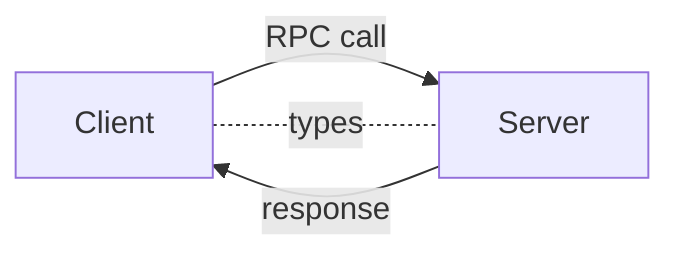

# Project {.grid .grid-cols-2 .gap-4}

::: column
- Monorepo:

  - API
  - Interactive Web app with good SEO
  - Separate mobile client that uses a mobile feature

- Other requirements:

  - Fully Type-safe
  - Use a database
  - Use a meta-framework
  - Dockerized backend
  - Authentication
:::

::::: column
::: warning
You will not get a passing grade if:

- There is a security vulnerability
- Your backend is not dockerized
- Your app isn't interactive enough
- Part of your app doesn't run
- No authentication
- No SSR
:::
:::::

# Outline

#. API Design *($\to$ oRPC)*

#. Component-based architecture *($\to$ React, React Native)*

#. Client-side data fetching *($\to$ TanStack Query)*

#. Advanced React *(Hooks)*

#. Authentication

# JavaScript

::: question
What programming language should we use?
:::

- JavaScript is (pretty much) the only programming language
  that can run in the browser.

- JavaScript can run on the browser, on the server and for mobile apps.

- React can run on the browser, on the server and on mobile phones.

- Many of Javascript's drawbacks do not apply to TypeScript.

# TypeScript {.w-1--2}

::: definition
TypeScript is a statically-typed superset of JavaScript that adds optional types, compile-time checks, and better IDE tooling while compiling to plain JavaScript.
:::

```typescript
function makeUser (name: string, age: number) {
  return { name, age }
}

const user = makeUser('Ana', 20)
// inferred type: { name: string; age: number }
```

::: {.remark title="End-to-end type safety"}
When frontend and backend share types (monorepo or shared packages),
TypeScript lets you verify API contracts at compile time, catching mismatches before runtime.
:::

`Type inference` lets TypeScript deduce types, reducing annotations while keeping safety.

# Monorepos {.w-1--2}

::: definition
**What is a monorepo?**

A monorepo (monolithic repository) is a single repository containing multiple projects or packages, typically:

- Backend API
- Frontend web application  
- Mobile app
- Shared utilities/packages
- All sharing the same version control history
:::

# Monorepos {.grid .grid-cols-2 .gap-8}

::::: col
### Advantages

- **Code sharing:** Reuse utilities, types, schemas across projects
- **Type safety:** Share TypeScript types between frontend and backend
- **Atomic commits:** Related changes across packages in one commit
- **Unified dependency management:** Shared dependencies across packages, unified tooling
- **Easier refactoring:** Tools can refactor across the entire codebase
- **Single CI/CD:** One pipeline for all packages

### When to use

- ✅ Full-stack projects with shared code
- ✅ Multiple packages with tight coupling
- ✅ Small to medium teams
- ❌ Independent packages with different release cycles
- ❌ Different teams with separate access needs
:::::

::::: col
### Drawbacks

- **Repository size:** Large repositories can be slower to clone/work with
- **Build complexity:** Need sophisticated build tools to avoid rebuilding everything
- **Team scalability:** More coordination needed between teams
- **CI/CD overhead:** One failing package can block all packages
- **Access control:** Harder to restrict who sees/accesses specific packages
- **Learning curve:** Requires understanding monorepo tooling (Nx, Turborepo, Yarn workspaces)
:::::


# API types {.w-1--2}

::: question
What types of API design are you familiar with?
:::

::: remark
A lot of progress has been made to improve DX in client/server communications,
but some are Web-only and not applicable for your project.
:::

# REST {.w-1--2}

::: definition
REST (Representational State Transfer) is an architectural style for APIs using:

- HTTP verbs: GET, POST, PUT, DELETE, PATCH
- Resource-based URLs: `/users`, `/users/123`, `/posts/456/comments`
- Standard HTTP status codes: 200, 201, 400, 404, 500
- Stateless communication
:::

# REST {.w-1--2}

## Advantages

- ✅ **Industry standard** — Wide tooling, libraries, and documentation
- ✅ **Cacheable** — Built-in HTTP caching mechanisms
- ✅ **Bookmarkable** — Can share/bookmark specific resources
- ✅ **Simple to understand** — Straightforward resource-action model
- ✅ **Decoupled** — Clients and servers can evolve independently

## Drawbacks

- ❌ **Over-fetching** — Get more data than needed
- ❌ **Under-fetching** — Need multiple requests for related data
- ❌ **No type safety** — Must manually validate response structure
- ❌ **Verbose** — Many endpoints needed for complex operations
- ❌ **Version management** — Often requires `/v1/`, `/v2/` endpoints

# Fetch API

In JavaScript,
HTTP requests are performed via the `fetch` function.
It returns a **promise**.

:::::::::: {.grid .grid-cols-2 .gap-4}
::::: col
```javascript {.run}
const url = 'https://pokeapi.co/api/v2/pokemon/squirtle'
const promise = fetch(url)
console.log(promise)
```
:::::

::::: col
The function `fetch` returns a **promise** of a response, not the value we expect.
:::::
::::::::::

:::::::::: {.grid .grid-cols-2 .gap-4}
::::: col
```javascript {.run}
const url = 'https://pokeapi.co/api/v2/pokemon/squirtle'
const res = await fetch(url)
const data = await res.json()
console.log(JSON.stringify(data, null, 2))
```
:::::

::::: col
`await` means "pause the execution of this bit and resume later with the **result** of the promise.
:::::
::::::::::

# Promises {.w-1--2}

::: exercise
Guess in what order A, B and C will appear.
:::

~~~ ts {.run}
async function someAsyncFunction() {
  console.log("A")

  // wait 1 second
  await new Promise(r => setTimeout(r, 1000));

  console.log("B")
}

someAsyncFunction()
console.log("C")
~~~

# Example: PokeAPI {.grid .grid-cols-2}

```typescript {framework="solid" .run runImmediately=true hideEditor=true}
import { createSignal, createResource } from 'solid-js'

function App() {
  const [path, setPath] = createSignal('pokemon/ditto')
  const [data] = createResource(path, async (path) => {
    const res = await fetch('https://pokeapi.co/api/v2/' + path)
    return await res.json()
  })
  return (
    <>
      <input value={path()} onInput={e => setPath(e.target.value)} />
      <pre>{JSON.stringify(data(), null, 2)}</pre>
    </>
  )
}
```

::::: col
- You need to know the URLs, verbs, etc.

- You don't have type safety
:::::

# OpenAPI standard

::: definition
OpenAPI is a machine-readable specification for describing HTTP APIs (formerly Swagger). It lets tools understand endpoints, parameters, and payloads.
:::

- ✅ **Interactive docs:** OpenAPI UI for testing endpoints
- ✅ **Code generation:** Generate client SDKs and server stubs
- ✅ **Validation & testing:** Validate requests/responses and mock servers
- ✅ **Contract-driven development:** Share spec as the source of truth
- ✅ **Ecosystem:** Integrations with API gateways, CI checks, and monitoring

# PokeAPI docs (Scalar)

<Iframe src="/scalar.html" class="w-full h-full" />

# Over & Under-fetching {.grid .grid-cols-2 .gap-4}

::::: col
### Overfetching

```
GET /posts/123
```

```json
{
  id: 123,
  title: "Hello",
  content: "...",
  author: {...},    // ← not needed
  comments: [...],  // ← not needed
  likes: 1234
}
```
:::::

::::: col
### Underfetching

One endpoint might not have enough data,
so we need multiple requests.

```
GET /posts/123
```

```json
{
  title: "Hello",
  author: 456,
}
```

```
GET /users/456
```
``` json
{
  name,
  avatar
}
```
:::::

# GraphQL {.w-1--2}

Client/Server communications need to be efficient when dealing with mobile clients.

::::: definition
GraphQL is a query language for APIs providing:

- **Query language** — Client specifies exactly what data it needs
- **Strongly typed schema** — Server defines type system
- **Single endpoint** — Usually `/graphql`
- **Nested queries** — Fetch related data in one request
:::::

```graphql
{
  pokemon(name: "pikachu") {
    types
    weight
    moves {
      description
      name
    }
  }
}
```

# GraphQL {.grid .grid-cols-2 .gap-4}

::::: col
**Advantages:**

- ✅ **Precise data fetching** — No over-fetching or under-fetching
- ✅ **Strongly typed schema** — Better documentation and validation
- ✅ **Introspection** — API is self-documenting
- ✅ **Single request** — Get all related data in one query
- ✅ **Great for mobile** — Clients control bandwidth usage
:::::

::::: col
**Drawbacks:**

- ❌ **Complex to implement** — Steep learning curve
- ❌ **Query complexity** — Clients can write expensive queries
- ❌ **Not cacheable** — All requests are POST, bypassing HTTP caching
- ❌ **File uploads** — Multipart file uploads are more complex
- ❌ **Monitoring** — Harder to track individual operations
- ❌ **Codegen**
:::::

# GraphQL example

<Iframe src="https://learning.ecam.be/graphql/" class="w-full h-full" />

# RPC {.w-1--2}

::: definition
RPC (Remote Procedure Call) is a programming model where clients invoke named procedures on a server over the network, as if calling local functions.
:::

In web development this means calling typed functions (procedures) instead of resource URLs.
It simplifies client code and enables end-to-end typing and better IDE support.

<Iframe src="https://assets.trpc.io/www/v10/v10-dark-landscape.mp4" class="w-full h-1/2" />

# Server functions {.w-1--2}

Pioneered by Solid-Start, popularized by Next.js.

SvelteKit and TanStack Start have since adopted a more "secure" version.

``` ts
async function getTasks() {
  'use server'
  return await db.select().from('tasks')
}
```

``` ts
// client.ts
// This gets compiled into a fetch call!
getTasks()
```

::: remark
The DX is incredible, with full type-safety.

- It doesn't work with mobile clients
- People forget they are opening API endpoints,
  leading to huge security vulnerabilities.
:::

# oRPC {.w-1--2}

::: center
{.mx-auto .h-32}
:::

::: definition
oRPC is an RPC (Remote Procedure Call) framework combining:

- Type-safe calls without code generation
- Automatic OpenAPI documentation
- Simple, function-based API design
:::



# oRPC example {.grid .grid-cols-2 .gap-4}

::::: col
```typescript
// server.ts
export const router = {
  user: {
    get: os
      // Input validation
      .input(z.object({ id: z.string() }))
      // Function
      .handler(({ input }) => {
        return {
          id: input.id,
          name: 'hello',
        }
      })
  },
}
```
:::::

::::: col
```typescript
// client.ts
async function show() {
  const user = await orpc.user.get({ id: '123' })
  // user inferred as { id: string; name: string }

  // ...
}
```
:::::

# oRPC advantages {.w-1--2}

- ✅ **Immediate type-safety** — Types automatically inferred across the boundary
- ✅ **No code generation** — Types work without build steps
- ✅ **Easy testing** — OpenAPI UI built-in for interactive testing
- ✅ **Simple** — Just define TypeScript functions on server, call from client

| | REST | GraphQL | oRPC |
|---|---|---|---|
| Type safety | Manual | Schema | Automatic ✅ |
| Learning curve | Easy | Complex | Easy ✅ |
| Caching | ✅ | ❌ | ❌ |
| Code generation | ❌ | Optional | Not needed ✅ |
| Testing UI | Postman | GraphiQL | OpenAPI ✅|

# Zod {.grid .grid-cols-2}

::::: col
- TypeScript's type hints

- All client/server communications need to be **validated**.

- Zod is a validation library that integrates well with **TypeScript**.
:::::

::::: col
```typescript {.run}
import z from 'zod'

const userSchema = z.object({
  user: z.email(),
  password: z.string().min(5),
})

try {
  const user = userSchema.parse({
    user: 'ngy@ecam.be',
    extraField: 'hello',
    password: '12345',
  })
  console.log(JSON.stringify(user, null, 2))
} catch(error) {
  console.log('User not valid', error)
}
```
:::::

# Prisma {.w-1--2}

::: center
{.mx-auto .h-20}
:::

::: definition
Prisma is an open-source **ORM and database toolkit** for TypeScript and Node.js. It provides a declarative schema (`schema.prisma`), type-safe database client, migrations, and tooling to make database access predictable and productive.
:::

# Prisma example {.w-1--2}

::: col
```prisma
// schema.prisma
model User {
  id    String @id @default(uuid())
  email String @unique
  name  String
}
```
:::

::: col
```typescript
async function main() {
  const user = await prisma.user.create({
    data: { email: 'a@b.c', name: 'Ana' }
  })
  // user is typed:
  // { id: string; email: string; name: string }
}
```
:::

# Demo

<Iframe src="https://stackblitz.com/github/middleapi/orpc/tree/main/playgrounds/svelte-kit?embed=1&file=src%2Flib%2Forpc.server.ts&view=editor" class="w-full h-full" />