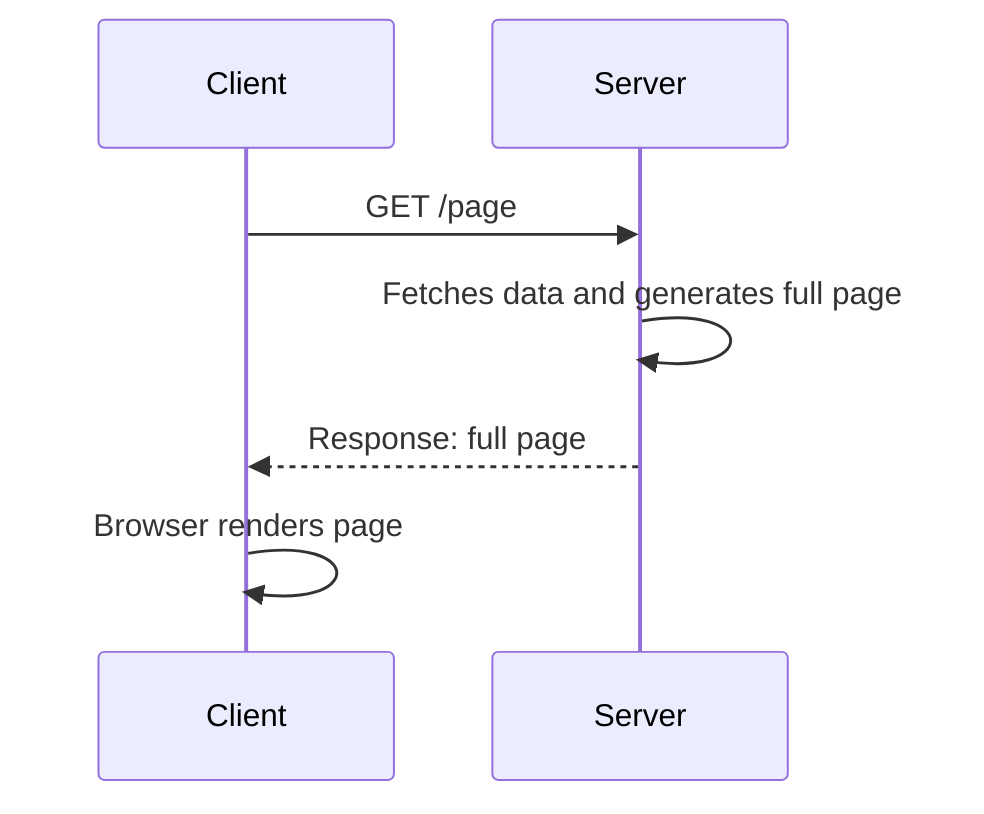
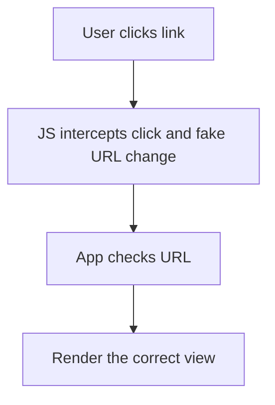
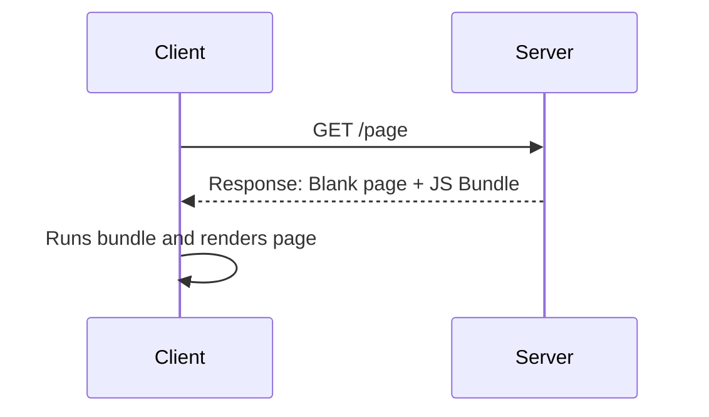
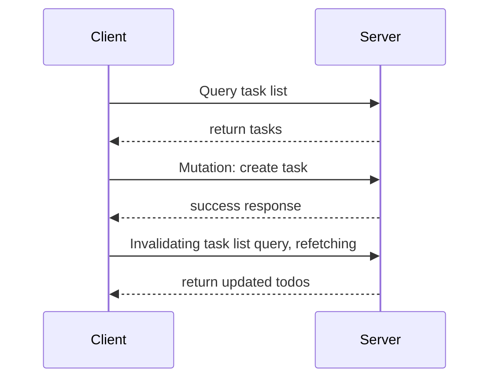
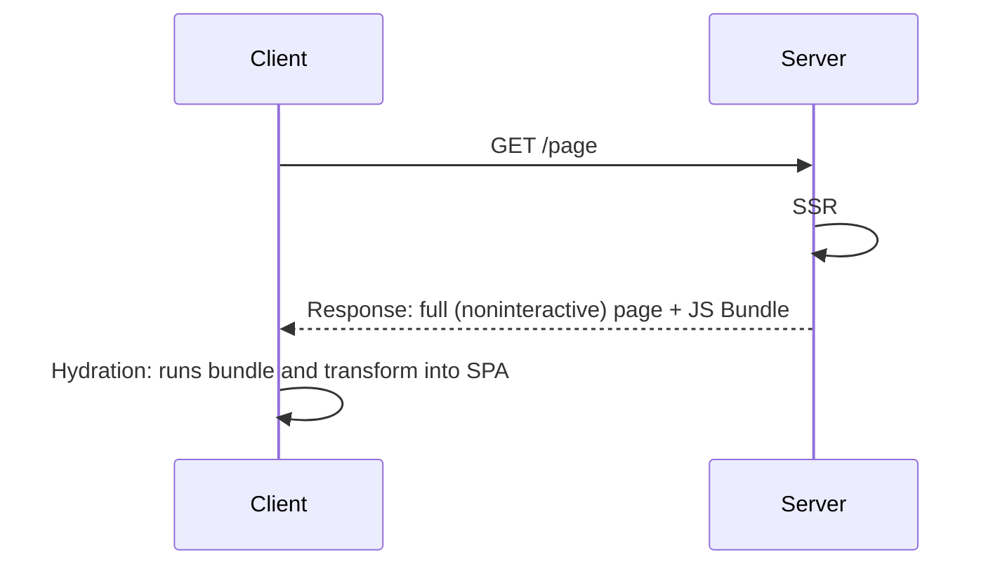
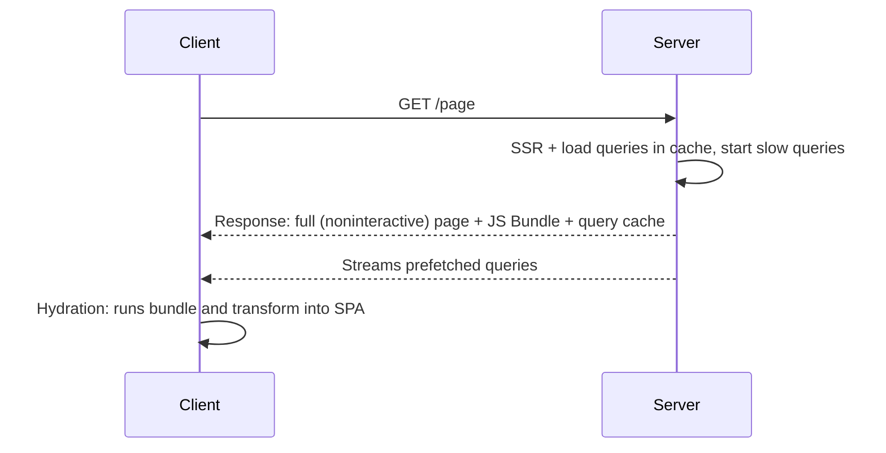

# Overview {.w-1--2}

We are going to talk about **routing** and **data fetching**
in the following architecture styles:

- Multiple Page Applications

- Single Page Applications and Mobile Applications with components-based architecture

  *Framework*: Expo

- Isomorphic Applications

  *Framework*: TanStack Start (TanStack Router + TanStack Query + ...)

# Recall {.w-1--2}

- oRPC: call API routes as if they are type-safe local functions

- React:

  <Youtube src="https://www.youtube.com/watch?v=8pDqJVdNa44" class="mx-auto" />

  - Builds UI **declaratively** (repetition, encapsulation, tests, etc.)
  - Runs on server, browser and mobile phones
  - **Reruns** components:
    - Great to avoid mutations
    - Bad design: self DDOS

# Multiple Page Applications {.grid .grid-cols-2}



::: column
- **Data fetching** is fully handled by the **server**

  - Good for SEO: server is close to the data source (e.g. database)
  - Data is fresh, no inconsistency
  - Low interactivity, bad UX.

- **Routing** is handled by the **server**.

  - Association between URL and content is decided by server-side code.
  - Routing is slow because of the **full page (re)load**
  - DOM is populated by the HTML generated by the server (server-side rendering)
:::

# Single Page Application: definition and rendering {.grid .grid-cols-2}

::::: column
A **classical SPA** looks like this:

```html
<!DOCTYPE html>
<html>
  <head>
    <!-- Metadata -->
  </head>
  <body>
    <div id="app">
    </div>
    <script src="/bigBundle.js"></script>
  </body>
</html>
```
:::::

::::: column
- The page is **initially blank** until the JS file has been fully downloaded and fully executed.

- The JS code instructs the browser on which DOM elements to create.
  $\to$ **client-side rendering**,
  and it is **slow**.

- "Page changes" are faked.
  We only **mutate the DOM** to avoid page reloads.
  This is **fast**.

  ```js
  // Changes browser url and associate state with it
  history.pushState(state, title, url)
  ```

::: remark
This is **very difficult** to do in Vanilla JavaScript,
and why React has been so successful.
The DOM is constantly being mutated
without having to write a single mutation yourself.
:::
:::::

# Client-side Routing {.grid .grid-cols-2}



# Client-Side Routing {.flex}

::: {.self-center}
- Wayback Machine archives popular web pages

- On the right are snapshots of Kim Kardashian's profile

- Try a date like 11 November 2016

::::: question
Why is the page blank?
:::::
:::

<Iframe class="w-2/3 rounded-xl border shadow-xl" src="https://web.archive.org/web/20140101000000*/https://www.instagram.com/kimkardashian/" class="w-full h-full" />

# Single-Page applications {.grid .grid-cols-2}

::: self-center
- SPAs need to implement their own routing
  $\to$ Expo Router (mobile), TanStack Router (web)

- Components locally manage their own data fetching
  $\to$ much harder to control

  - Many requests happen all the time
  - Manage loading states
  - Tearing
  - Partial updates $\to$ inconsistent state, out-of-date data
  - Race conditions
  - Need for caching/deduping, and invalidation

- SPAs have great UX,
  but have slow initial render.
:::



# Naive solution: `useEffect`

```tsx {.run framework="react" .grid .grid-cols-2}
import { useState, useEffect } from "react";

function App() {
  const [users, setUsers] = useState([]);
  useEffect(() => {
    fetch("https://jsonplaceholder.typicode.com/users")
      .then(res => res.json())
      .then(data => {
        setUsers(data);
      });
  }, []);
  return (
    <ul>
      {users.map(u => (
        <li key={u.id}>{u.name}</li>
      ))}
    </ul>
  );
}
```

# CloudFare

<Iframe class="w-full h-full border rounded-xl shadow" src="https://blog.cloudflare.com/deep-dive-into-cloudflares-sept-12-dashboard-and-api-outage/" class="w-full h-full" />

# Local state {.w-1--2}

```tsx
function Item() {
  // ...
  return (
    <>
      {/* ... */}
      <button onClick={buyItem}>
        Buy now
      </button>
      {/* ... */}
    </>
  )
}

function Cart() {
  const [count, setCount] = useState(0)
  return (
    <button>{count} Basket</button>
  )
}
```

::: question
In the above code,
how can clicking on "buy now" affect the state of the Cart component?
:::

# React Context {.grid .grid-cols-2}

```tsx {.text-sm .run framework="react"}
import { createContext, useContext, useState } from 'react';

const Context = createContext({
  count: 0,
  increment: () => {},
});

function App() {
  const [count, setCount] = useState(0);
  return (
    <Context.Provider value={{
      count,
      increment: () => setCount(count + 1),
    }}>
      <OtherComponent />
    </Context.Provider>
  );
}

function OtherComponent() {
  const { count, increment } = useContext(Context);
  return (
    <div>
      <p>Count: {count}</p>
      <button onClick={increment}>Increment</button>
    </div>
  );
}
```

::: column
- In this code, `Context` allows us to declare **global state**.

- Even though `count` is declared in `App`,
  it is read and modified in `OtherComponent`.

- Server data should belong to a context.
  Creating a context that could hold all your queries
  in a type-safe way is a difficult task.
  In practice, this is how TanStack Query (see later) works.
:::

# Deduping {.w-1--2}

As your code is local,
some data might be fetched **multiple times**
by different components.
Requests need to be **deduped**.

::: example
Many components need to query the data associated with the current user.

```tsx
function Navbar() {
  const [user, setUser] = useState(null)
  // ...
  return (
    <>
      {/* ... */}
      {user && (
        <button onClick={() => {
            ///
        }}>
          Sign out
        </button>
      )}
      {/* ... */}
    </>
  )
}
```
:::

# Out-of-date data {.w-1--2}

```tsx
function SignOut() {
  return (
    <button onClick={() => {
      // ...
    }}>
      Sign out
    </button>
  )
}
```

- When you click on the "Sign out" button,
  all your user data,
  everywhere else in your app,
  should disappear.

- Could be implemented with a context,
  but difficult.

# TanStack Query {.w-1--2}

::: definition
TanStack Query is a library that helps you **fetch**, **cache**
and **update** server data.
It works on the browser, the server and on native.
:::

- Declarative description of needed data and dependencies.

  ::: example
  This component needs a task list, and to be able to add tasks.
  Adding tasks should automatically trigger a refetch of the task list.
  :::

- Central Caching for deduping and network performance

- Handles loadings, and error states

- etc.

# Queries and mutations {.grid .grid-cols-2 .gap-8}

::::: column
::: definition
- A **query** is a **declarative specification** of a data-fetching operation.
- A **mutation** is a **declarative specification** of a data-modifying operation.
:::

::: example
- Listing tasks is a **query**
- Adding a task is a **mutation**
:::

In practice, we often want to refetch (*invalidate*) queries after mutations.
:::::

::::: column

::: {.example title="CRUD: Todo App"}
After creating a new task (**mutation**),
we need to invalidate the *task list* query to trigger a refetch.


:::
:::::

# Tanstack Query example {.w-3--5}

oRPC provides deep integration with TanStack Query to provide all these features.

```tsx
function TodosScreen() {
  const [text, setText] = useState("");
  const queryClient = useQueryClient()
  const tasks = useQuery(orpc.tasks.list.queryOptions());
  const addTask = useMutation(orpc.tasks.create.mutationOptions({
    onSuccess: () => {
      queryClient.invalidateQueries()
    }
  }))
  return (
    <div>
      <ul>
        {tasks.data?.map(task => <li>{task.id}</li>)}
      </ul>
      <input value={text} onChange={e => setText(e.target.value)} />
      <button
        onClick={() => {
          addTask.mutate({ title: text });
          setText("");
        }}
      />
        Add
      </button>
    </div>
  );
}
```

# Optimistic updates

In the previous example,
the new task appear only after a round-trip to the server.
This can be slow.

Let us **optimistically** show the new task on the UI
by editing the cache.

```tsx
const addTask = useMutation(orpc.tasks.create.mutationOptions({
  onMutate: async () {
    queryClient.setQueryData(orpc.tasks.list.key(), (old) => [
      ...old,
      { title: text },
    ])
  },
  onSuccess: () => {
    queryClient.invalidateQueries()
  }
}))
```

A more correct example is available
[here](https://tanstack.com/query/v4/docs/framework/react/guides/optimistic-updates).

# Invalidate on every mutation {.w-1--2}

Generally, mutations should invalidate at least some queries,
but keeping track of them can be tedious.

An alternative would be to invalidate
all active queries.

Find where your `queryClient` is defined,
and edit this as follows:

```ts
const queryClient = new QueryClient({
  mutationCache: new MutationCache({
    onSuccess: () => {
      queryClient.invalidateQueries()
    },
  }),
})
```

::: remark
This behaviour is the default one on Solid-Start and React-Router (Remix).
:::

# Routing: mobile vs web {.w-1--2}

- Recall: Apps need to implement their own routing

- Data-fetching has the same issues on Web and Mobile
  $\to$ use TanStack Query for both

- Routing is different!

  - **Mobile**: fetch data and show (application code is already on the phone)
  - **Web**:
    - download page code, run it, fetch data.
    - Load data and page code in parallel
      $\to$ faster $\to$ better SEO.

::: remark
Preloading data is only useful with a cache.
Our Web Router needs to integrate with TanStack Query.
:::

# TanStack Router {.flex}

::::: {.w-3--5}
```ts
export const Route = createFileRoute("/")({
  loader: async ({ context: { queryClient }}) => {
    await queryClient.ensureQueryData(orpc.tasks.list.queryOptions())
  },
  component: () => {
    const tasks = useSuspenseQuery(orpc.tasks.list.queryOptions())
    return (
      <ul>
        {tasks.data?.map(task => <li>{task.title}</li>)}
      </ul>
    )
  },
})
```

::: remark
If the data we want to load is not SEO critical,
you should use
```tsx
queryClient.prefetchQuery(orpc.tasks.list)
```
instead of `await queryClient.ensureQueryData(...)`.
It starts the data fetching, but doesn't block the rendering of the page.
:::
:::::

::: {.self-center}
- Preloads data when hovering links

- Loads data and route code in parallel for better SEO.

- Can choose to defer rendering for crucial data (`ensureQueryData`)
  or to start loading and stream the data when it's ready (`prefetchQuery`).

::::: remark
It is your job as a developer to choose the appropriate strategy.
:::::
:::

# Suspense {.w-1--2}

::: info
`Suspense` allows you to display a fallback
until the children components have finished loading.
:::

```tsx
function Users() {
  const users = useSuspenseQuery(
    orpc.users.list.queryOptions()
  );
  return (
    <ul>
      {users.data?.map(user => (
        <li key={user.id}>{user.name}</li>
      ))}
    </ul>
  );
}
function App() {
  return (
    <Suspense fallback={<div>Loading users...</div>}>
      <Users />
    </Suspense>
  );
}
```

# SSR

SPAs are blank on initial load $\to$ bad SEO.

::: hint
Since JavaScript can run on the browser,
why can't we run our app on the **server** first,
so that the page isn't blank?
:::


```tsx
import { renderToReadableStream } from "react-dom/server";

function Component(props: { message: string }) {
  return (
    <body>
      <h1>{props.message}</h1>
    </body>
  );
}

const stream = await renderToReadableStream(<Component message="Hello from server!" />);
```

# Isomorphic App {.columns-2}

::: definition
An **isomorphic application** is a **single codebase**,
compiled into a **client bundle** and a **server bundle**.

An isomorphic application behaves:

- like a Multiple Page Application on the first render
- like a Single Page Application afterwards.
:::



# TanStack Start {.w-1--2}

::: definition
TanStack Start is a framework for writing isomorphic apps.
:::



By default, your TanStack Start can run both on the server and on the client.

# Server Functions {.w-1--2}

An incredible feature that we don't use because it doesn't work for mobile.

```ts
// Create an RPC
export const getServerTime = createServerFn()
  .handler(async () => {
    return new Date().toISOString()
  })
```

- On the **server**, `getServerTime` runs normally
- On the **client**, `getServerTime` is a GET request to
  a specially created endpoint, which runs the function.

::: remark
On the surface, this seems identical to oRPC,
but it's in reality much more powerful.
It allows you to colocate code like this:

``` text
tasks/
  TaskList.tsx
  server.ts # server functions here
```

oRPC forces you to group your unrelated server code together.
:::