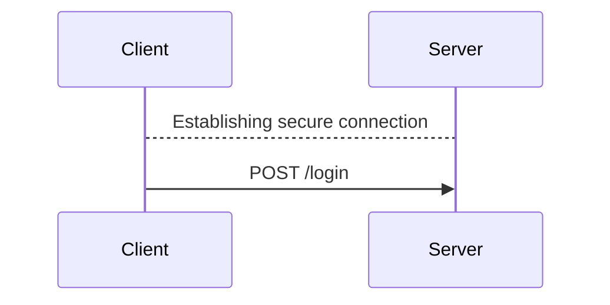
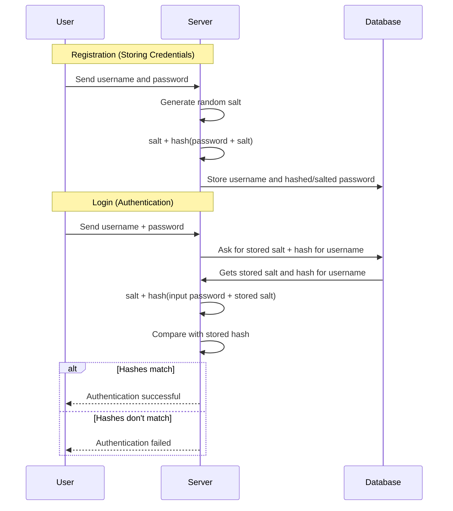
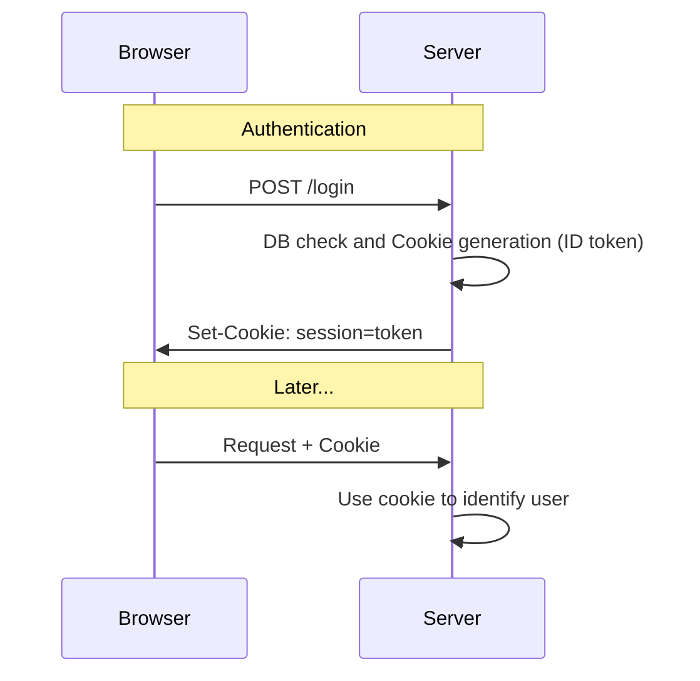
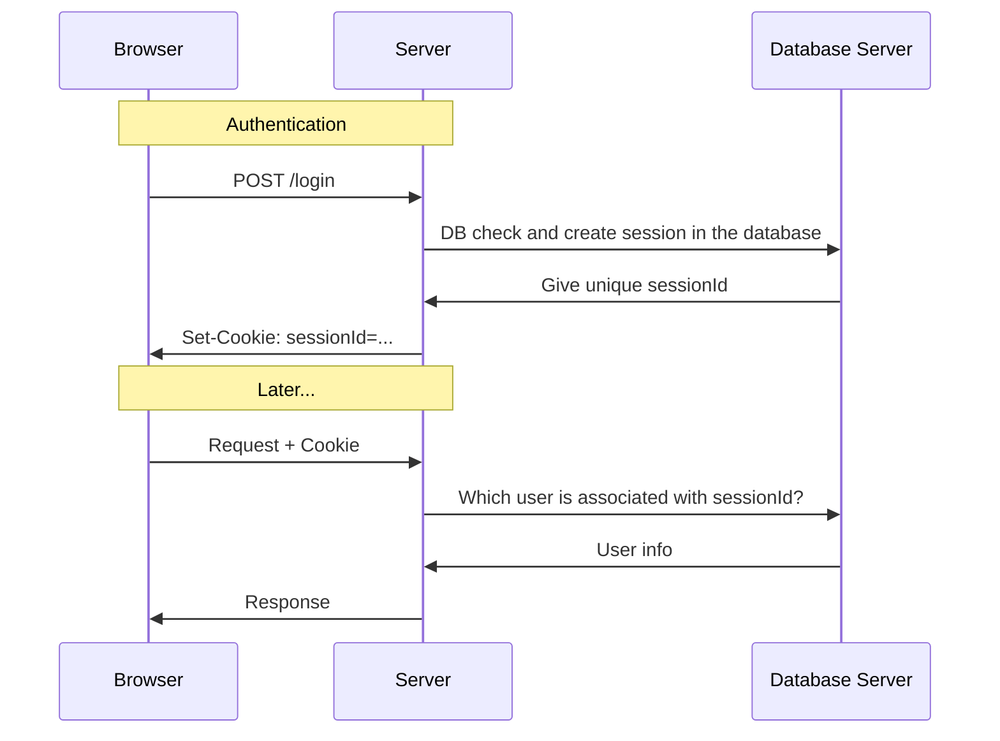
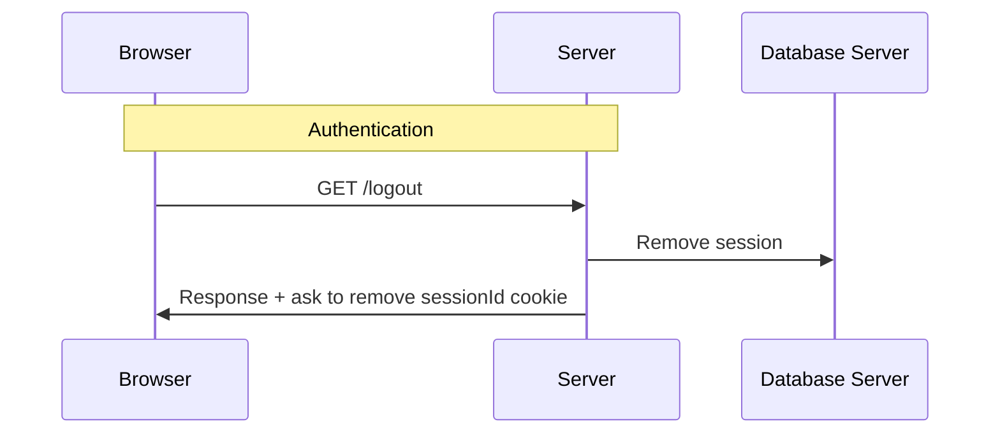
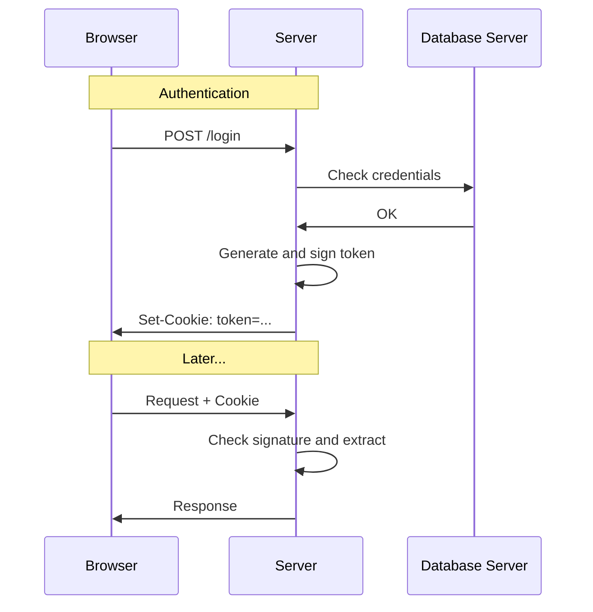
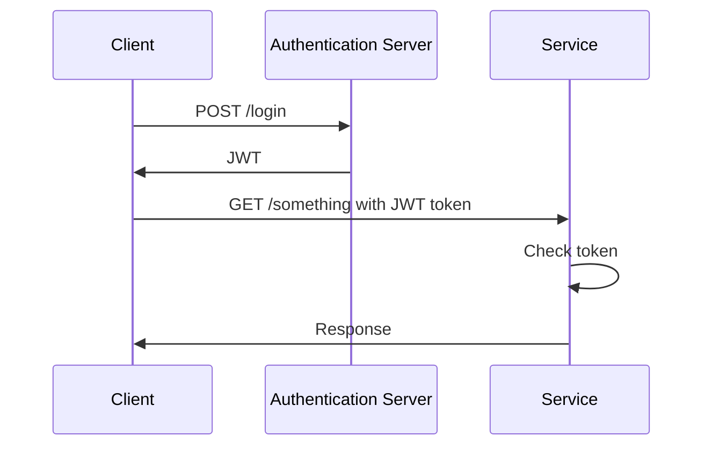
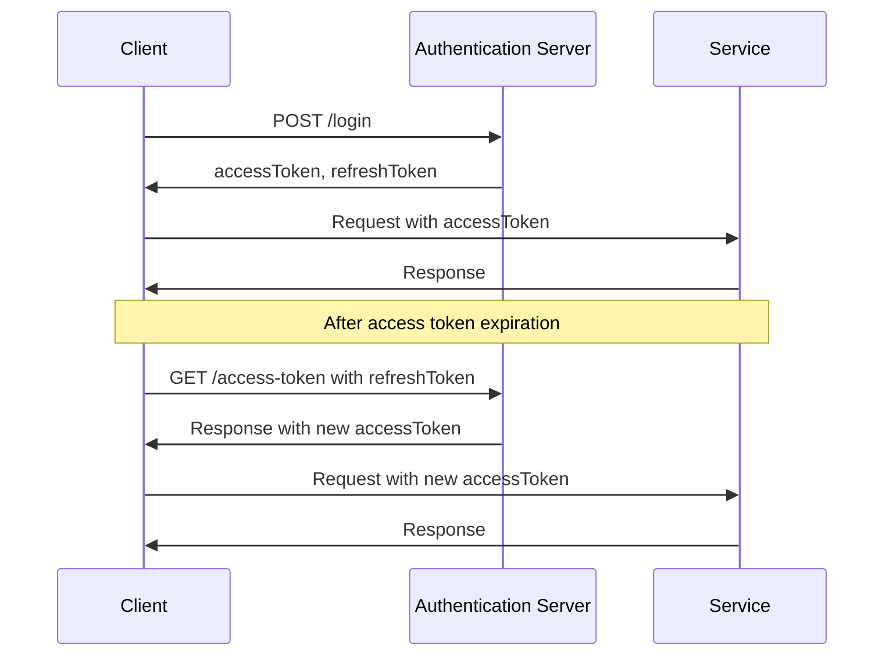
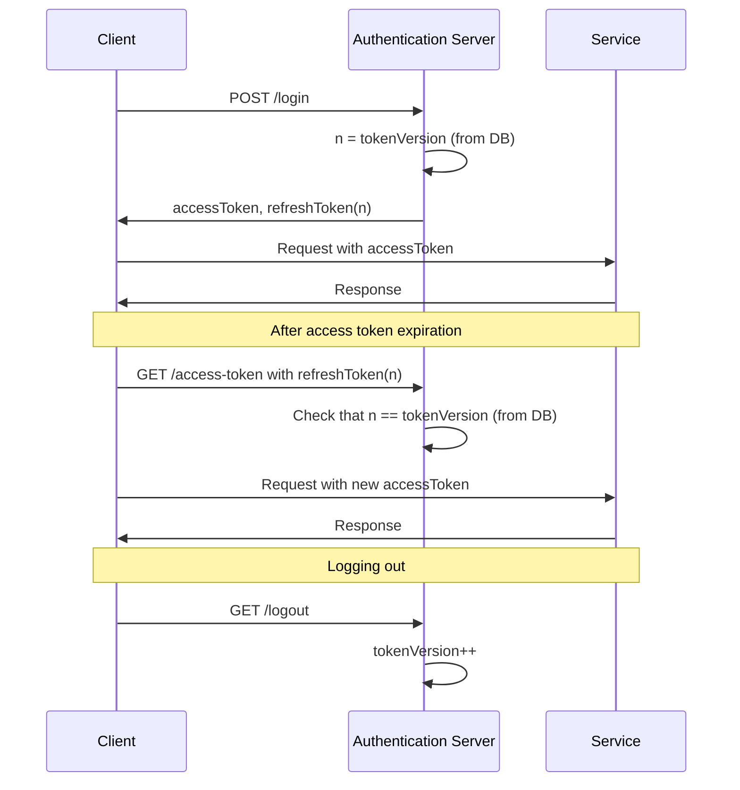
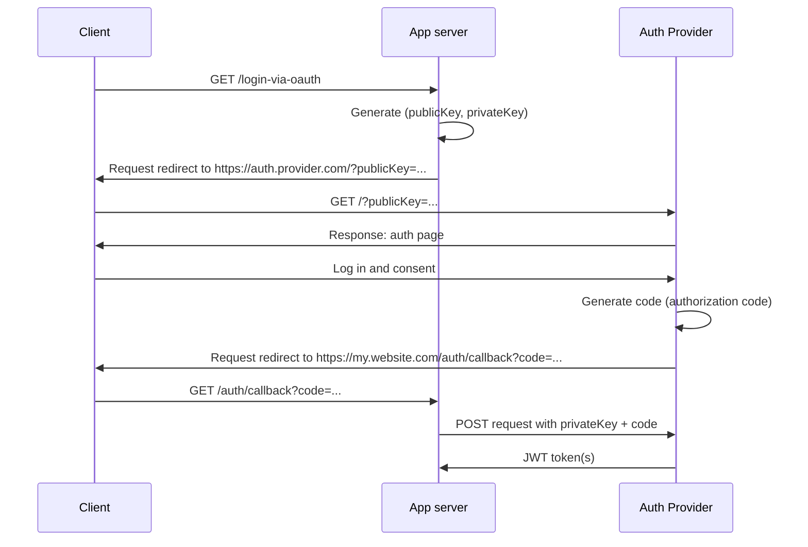

# Recall

- **oRPC**: for OpenAPI-compliant TypeSafe API

- **React**: library for building web/native user interfaces declaratively

- **TanStack Query**: React library for centrally cached, declarative data-fetching and invalidation.

- **Router**: SEO optimisation required for Web!
  - Expo Router (mobile)
  - TanStack Router: integrates with TanStack query
    to specify which queries must be preloaded at the same time as the route.

- **Isomorphic App (web)**:
  Single codebase that (mostly) runs on **both** client and server.
  - Server: Produce non-interactive HTML render for SEO (SSR)
  - Client
    - SSR: Start with non-interactive HTML coming from the server
    - Hydration: transfromation into an SPA
    - SPA: routing is faked

- **TanStack Start**: React framework for building isomorphic apps.
  Provides server capabilities for TanStack Router and TanStack Query.

# Authentication issues {.w-1--2}

- How can you send the password to the server
  in such a way no one else can read it?

- How do we safely store the passwords in the database,
  so that if the latter is compromised,
  the users are still safe.

- As sessions are persisted by cookies that are saved on the client,
  how do you make sure they cannot be faked by the user?

- How do SSO and OAuth work?

# HTTPS {.w-1--2}

::: question
How can you send the password to the server
in such a way no one else can read it?
:::

Remember that HTTP communications use plain text.

Using HTTP**S** = HTTP + TLS (but formerly SSL).



# Storing passwords {.w-1--2}

::: question
How do we safely store the passwords in the database,
so that if the latter is compromised,
the users are still safe.
:::

Any ideas?

# Hashing {.w-1--2}

::: example
```{.js .run tailwind=true framework="solid" runImmediately=true hideEditor=true}
import { createSignal, createResource } from 'solid-js'

async function sha256(message: string) {
  const msgBuffer = new TextEncoder().encode(message)
  const hashBuffer = await crypto.subtle.digest('SHA-256', msgBuffer)
  const hashArray = Array.from(new Uint8Array(hashBuffer))
  const hashHex = hashArray.map((b) => b.toString(16).padStart(2, '0')).join('')
  return hashHex
}

function App() {
  const [string, setString] = createSignal('Bonjour')
  const [hashed] = createResource(string, (str) => sha256(str))
  return (
    <div class="text-2xl">
      <label>
        String: <input class="border p-2" onInput={(e) => setString(e.target.value)} value={string()} />
      </label>
      <p>
        Hash:{' '}
        <code>
          <small class="clickable">{hashed()}</small>
        </code>
      </p>
    </div>
  )
}
```
:::

::: question
What are the properties of hashing,
and what makes it more suitable than encryption for storing passwords?
:::

# Collisions {.w-1--2}

As hashes have the same number of characters
(e.g. $64$ characters for sha256),
this means that **collisions are possible**.

::: definition
A collision happens when two distinct strings have the
same hashes.
:::

<Calculator />

::: question
Is it easy to find a collision?
:::

# Is hashing enough? {.w-1--2}

::: example
This is an example of a table containing users and hashed passwords.

```{.js .run tailwind=true framework="solid" runImmediately=true hideEditor=true}
import { createSignal, createResource } from 'solid-js'

const info = [
  { login: 'tuxie', password: 'hello' },
  { login: 'lily', password: 'snake' },
  { login: 'choco', password: 'hello' },
  { login: 'bacon', password: 'hello' },
  { login: 'emma', password: 'ilovetuxie' },
]

async function sha256(message: string) {
  const msgBuffer = new TextEncoder().encode(message)
  const hashBuffer = await crypto.subtle.digest('SHA-256', msgBuffer)
  const hashArray = Array.from(new Uint8Array(hashBuffer))
  const hashHex = hashArray.map((b) => b.toString(16).padStart(2, '0')).join('')
  return hashHex
}

function App() {
  const [users] = createResource(() => {
    return Promise.all(
      info.map(async (u) => ({...u, password: await sha256(u.password) }))
    )
  })
  return (
    <>
      <table>
        <thead>
          <tr>
            <th>Login</th>
            <th>Passwords</th>
          </tr>
        </thead>
        <tbody>
          {users()?.map(u => (
            <tr>
              <td class="px-2 py">{u.login}</td>
              <td class="px-2 py"><code>{u.password}</code></td>
            </tr>
          ))}
        </tbody>
      </table>
    </>
  )
}
```
:::

::: question
What do you observe?
:::

# Rainbow tables {.w-1--2}

::: definition
Precalculated table containing the hash of many passwords
:::

::: question
How can we prevent such attacks?
:::

# Salting {.w-1--2}

::: definition
Salting a password is prefixing/suffixing it with a **random string**.
:::

$$
\text{password}
\to \text{{\color {red} salt}password}
\to \text{604498788992b}\dots
$$

We therefore **salt** and **hash** passwords

$$
\text{storedPassword}
= \text{salt} + \text{hash}(\text{salt} + \text{password})
$$

# Example with bcrypt {.grid .grid-cols-2}

::::: col

### Hashing only

```{.js .run tailwind=true framework="solid" runImmediately=true hideEditor=true}
import { createSignal, createResource } from 'solid-js'

const info = [
  { login: 'tuxie', password: 'hello' },
  { login: 'lily', password: 'snake' },
  { login: 'choco', password: 'hello' },
  { login: 'bacon', password: 'hello' },
  { login: 'emma', password: 'ilovetuxie' },
]

async function sha256(message: string) {
  const msgBuffer = new TextEncoder().encode(message)
  const hashBuffer = await crypto.subtle.digest('SHA-256', msgBuffer)
  const hashArray = Array.from(new Uint8Array(hashBuffer))
  const hashHex = hashArray.map((b) => b.toString(16).padStart(2, '0')).join('')
  return hashHex
}

function App() {
  const [users] = createResource(() => {
    return Promise.all(
      info.map(async (u) => ({...u, password: await sha256(u.password) }))
    )
  })
  return (
    <>
      <table>
        <thead>
          <tr>
            <th>Login</th>
            <th>Passwords</th>
          </tr>
        </thead>
        <tbody>
          {users()?.map(u => (
            <tr>
              <td class="px-2 py">{u.login}</td>
              <td class="px-2 py"><code>{u.password}</code></td>
            </tr>
          ))}
        </tbody>
      </table>
    </>
  )
}
```

:::::

::::: col

### Hashing and salting

```{.js .run tailwind=true framework="solid" runImmediately=true hideEditor=true}
import { createSignal, createResource } from 'solid-js'
import bcrypt from 'bcryptjs'

const info = [
  { login: 'tuxie', password: 'hello' },
  { login: 'lily', password: 'snake' },
  { login: 'choco', password: 'hello' },
  { login: 'bacon', password: 'hello' },
  { login: 'emma', password: 'ilovetuxie' },
]

function App() {
  const [users] = createResource(() => {
    return Promise.all(
      info.map(async (u) => ({...u, password: await bcrypt.hash(u.password, 10) }))
    )
  })
  return (
    <>
      <table>
        <thead>
          <tr>
            <th>Login</th>
            <th>Passwords</th>
          </tr>
        </thead>
        <tbody>
          {users()?.map(u => (
            <tr>
              <td class="px-2 py">{u.login}</td>
              <td class="px-2 py"><code>{u.password}</code></td>
            </tr>
          ))}
        </tbody>
      </table>
    </>
  )
}
```
:::::

# Authentication process

```{.js .run tailwind=true framework="solid" runImmediately=true hideEditor=true}
import { createSignal, createResource } from 'solid-js'
import bcrypt from 'bcryptjs'

const info = [
  { login: 'tuxie', password: 'hello' },
  { login: 'lily', password: 'snake' },
  { login: 'choco', password: 'hello' },
  { login: 'bacon', password: 'hello' },
  { login: 'emma', password: 'ilovetuxie' },
]

function App() {
  const [login, setLogin] = createSignal('')
  const [password, setPassword] = createSignal('')
  const [users] = createResource(() => {
    return Promise.all(
      info.map(async (u) => ({...u, password: await bcrypt.hash(u.password, 10) }))
    )
  })
  const user = () => users()?.filter(u => u.login === login())?.[0]
  const salt = () => user()?.password.substring(0, 29)
  const hash = () => user()?.password.substring(29, user()?.password.length)
  const [hashed] = createResource(() => [password(), salt()], async ([str, s]) => {
    if (str && s) {
      return await bcrypt.hash(str, s)
    }
    return ''
  })
  return (
    <>
      <table>
        <thead>
          <tr>
            <th>Login</th>
            <th>Passwords</th>
          </tr>
        </thead>
        <tbody>
          {users()?.map(u => (
            <tr>
              <td class="px-2 py">{u.login}</td>
              <td class="px-2 py"><code>{u.password}</code></td>
            </tr>
          ))}
        </tbody>
      </table>
      <div class="my-4">
        <label>
          Login: <input class="border" value={login()} onInput={e => setLogin(e.target.value)} />
        </label>
      </div>
      <div>
        {user() && <>
          <ul>
            <li>Login: {user()?.login}</li>
            <li>Salt: <code>{salt()}</code></li>
            <li>Hash: <code>{hash()}</code></li>
          </ul>
        </>}
      </div>
      {user() && <div class="my-4">
        <div>
          Password: <input class="border" value={password()} onInput={e => setPassword(e.target.value)} />
        </div>
        <div>
          Hashed: <code>{hashed()}</code>
        </div>
        {hashed() == user()?.password && <p class="text-green-800 my-2">Login and password are correct</p>}
      </div>}
    </>
  )
}
```

# Authentication steps {.grid .grid-cols-2}

::::: col
### Registration

1. User sends login and passwords

2. Server generates random salt and hashes the password with the salt

3. Server stores the login and the salted and hashed password
:::::

::::: col
### Authentication

1. User sends login and password

2. Is there a user with that login?

  - **NO**: Authentication fails.
  - **YES**: extract the salt and continue

3. Hash the sent password with the extracted salt.
   Is the result the same as in the database?

  - **NO**: Authentication fails.
  - **YES**: extract the salt and continue
:::::

# Authentication



# Session persistence {.w-1--2}

We need to **persist** the session,
otherwise the user would have to log in at every request.

This is done via **cookies**.

::: definition
A cookie is a string that the client presents at every request until it expires.
:::

# Cookies



# Inside the cookie {.w-1--2}

::: question
What should we put in that authentication cookie?
:::

Two possibilities:

- Session IDs:
  a random string **unique** to each user,
  the actual data is obtained through a database look-up.

- Token:
  the data associated with that user,
  cryptographically signed.

::: warning
Remember that cookies can be stolen.
If the cookie is entirely deterministic,
then a malicious user will have access to your account forever.
:::

# Interlude: symmetric cryptography {.w-1--2}

{.w-full}

# Interlude: asymmetric or public key cryptography {.w-1--2}

{.w-full}

- Share public key, but keep private key's private

- Both keys are **inverse of each other**

- Fast to generate a **key pair**,
  slow to find one key from another.

# Interlude: signature with symmetric cryptography {.w-1--2}

$$
\text{signature} = \text{hash}(\text{password} + \text{message})
$$

```{.js .run tailwind=true framework="solid" runImmediately=true hideEditor=true}
import { createSignal, createResource } from 'solid-js'

async function sha256(message) {
  const msgBuffer = new TextEncoder().encode(message)
  const hashBuffer = await crypto.subtle.digest('SHA-256', msgBuffer)
  const hashArray = Array.from(new Uint8Array(hashBuffer))
  const hashHex = hashArray.map((b) => b.toString(16).padStart(2, '0')).join('')
  return hashHex
}

function App() {
  const [message, setMessage] = createSignal('Hello world')
  const [hashed] = createResource(message, (str) => sha256('secret' + str))
  return (
    <>
      <textarea class="border w-full min-h-32" onInput={(e) => setMessage(e.target.value)}>{message()}</textarea>
      <pre>Signature: {hashed()}</pre>
    </>
  )
}
```

Try to fake the signature:

```{.js .run tailwind=true framework="solid" runImmediately=true hideEditor=true}
import { createSignal, createResource } from 'solid-js'

async function sha256(message) {
  const msgBuffer = new TextEncoder().encode(message)
  const hashBuffer = await crypto.subtle.digest('SHA-256', msgBuffer)
  const hashArray = Array.from(new Uint8Array(hashBuffer))
  const hashHex = hashArray.map((b) => b.toString(16).padStart(2, '0')).join('')
  return hashHex
}

function App() {
  const [message, setMessage] = createSignal('Hello world')
  const [key, setKey] = createSignal('secretKey')
  const [hashed] = createResource(() => [message(), key()], ([str, k]) => sha256(k + str))
  return (
    <>
      <textarea class="border w-full min-h-32" onInput={(e) => setMessage(e.target.value)}>{message()}</textarea>
      <label>Password: <input onInput={e => setKey(e.target.value)} class="border" value={key()} /></label>
      <pre>Signature: {hashed()}</pre>
    </>
  )
}
```

**Application**: signing cookies

# Interlude: signature with public key cryptography {.w-1--2}

{.w-full}

# Session ID



- Necessity to store session information
- Invalidation is easy
- Scaling also involves the session store (stateful)

Analogy: student number

# Session ID: logging out



# Tokens

- No separate storage needed (self-contained)

- Invalidation is more difficult

- Scaling is easy (stateless)

- More flexible (e.g. scope)

Analogy: student card

# Tokens: sequence diagram {.w-1--2}



# The JWT standard {.w-1--2}

Format: `xxxxx.yyyyy.zzzzz`

1. Header: token type and signing algorithm, encoded in base64.

```{.js .run tailwind=true framework="solid" runImmediately=true hideEditor=true}
import { createSignal } from 'solid-js'

function App() {
  const [value, setValue] = createSignal('{\n  "alg": "HS256",\n  "typ": "JWT"\n}')
  return (
    <div>
      <textarea class="border w-4/5 font-mono min-h-32" onInput={e => setValue(e.target.value)}>{value()}</textarea>
      <pre>Result: {btoa(value())}</pre>
    </div>
  )
}
```

2. Payload: JSON, encoded in base-64

```{.js .run tailwind=true framework="solid" runImmediately=true hideEditor=true}
import { createSignal } from 'solid-js'

function App() {
  const [value, setValue] = createSignal('{\n  "name": "lily",\n  "breed": "dachshund",\n  "iq": -8000\n}')
  return (
    <div>
      <textarea class="border w-4/5 font-mono min-h-32" onInput={e => setValue(e.target.value)}>{value()}</textarea>
      <pre>Result: {btoa(value())}</pre>
    </div>
  )
}
```

3. Signature = `sign(xxxxx.yyyyy)`

   Ensures that the token cannot be faked by the user.

**Tokens** are URL-safe thanks to the base64 encoding.

# JWT: example

<Iframe src="https://jwt.io/" class="w-full h-full" />

# SSO: Multiple services with JWT {.w-1--2}

Tokens shine when with multiple applications or services.



::: {.question title="Exam-style question"}
How would this work with session IDs?
Give the sequence diagram.
:::

# Token invalidation {.w-1--2}

::: question
How does logging out work?
:::

The only way to invalidate while being stateless,
is to ensure tokens are **short-lived**.
But that does require repeated log ins!
To avid this, we use **two tokens**.

- **Access token** contains an expiry date,
  and are used to communicate with your services.
  We will not attempt to invalidate them.

- **Refresh token** is long-lived,
  and is only used with the authentication server to get access tokens.

# JWT with access/refresh tokens {.w-1--2}



::: remark
Note that we haven't explained how logging out works
:::

# JWT: versioning {.w-1--2}

The **refresh** token often contains a **version** field.

``` json
{
  "user": "ngy@ecam.be",
  "version": 3,
  "exp": 1713967600
}
```

We will invalidate the token
by asking the **auth server** to refuse refresh tokens
for which the version is 3 or below (for the above token).

# JWT: logging out {.w-1--2}



# JWT: logging out {.w-1--2}

- At the end, `refreshToken(n)` will not be valid anymore,
  but the accessToken will still work.
  Logging out is not instantaneous!

- What happens if you were connected on multiple devices,
  and log out?

# OAuth: example {.w-1--2}

Authentication is **hard** (rate limiting, password reset, 2FA, etc.).
Can we delegate it to a third-party?

Yes, via OAuth, an **authorization standard**.

| Step                                 | URL                                             |
| ------------------------------------ | ----------------------------------------------- |
| Clicks 'Log in via Service Provider' | `https://my.website.com`                        |
| Redirection...                       | `https://auth.provider.com/?info=...`           |
| Log in and consent                   |                                                 |
| Redirection                          | `https://my.website.com/auth/callback?code=...` |
| Get token and use it to fetch info   |                                                 |

Note that the two websites only communicate via URLs:
$$
\begin{array}{c}
\text{my.website.com} \ \overset{\text{info=...}}{\longrightarrow} \ \text{auth.provider.com} \\
\ \underset{\text{code=...}}{\longleftarrow} \
\end{array}
$$
but need to ensure that the user has consented.

# OAuth: sequence diagram {.w-1--2}



- `privateKey` is a proof of identity for your application
- `code` is a proof of user consent for a website associated with `publicKey`
- Could your ISP get a token?

# In practice: Better-auth

- [Social login](https://www.better-auth.com/docs/concepts/oauth)

- [Expo integration](https://www.better-auth.com/docs/integrations/expo):
  mostly done for you