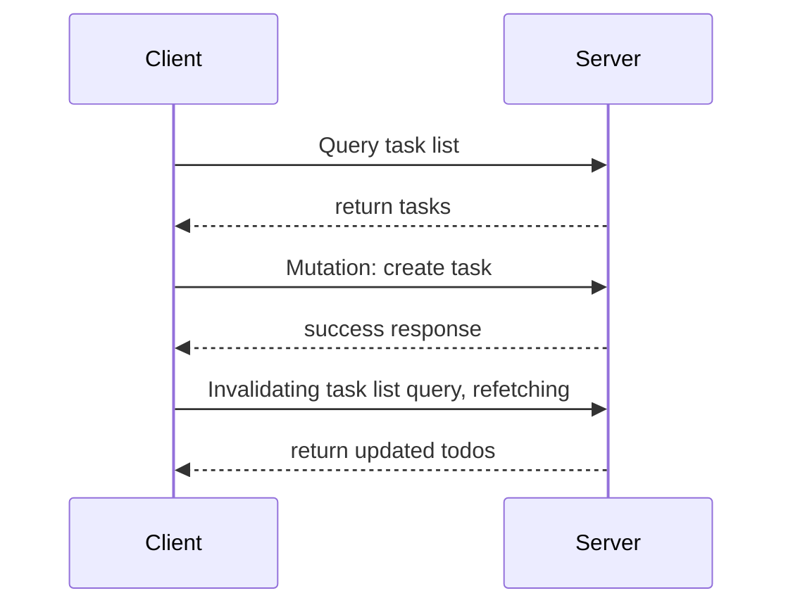

# Outline

- React Native

- Expo

- Routing

- Data fetching

# Hello World {.w-1--2}

::: column

- Download the [Expo Go](https://expo.dev/go)

- Start the development servers `pnpm run dev`

- Scan the QR code that appears in the terminal

  - On iOS: via the camera
  - On Android: `Expo Go > Scan QR code`

- Edit the file located at
  `apps/native/app/(drawer)/index.tsx`

::::: exercise
Start by improving your home screen.
:::::
:::

# React Native {.columns-2}

- `View` (`div` replacement)

- `Text`: only way to render text

- `Pressable` button or click handlers

  ```tsx
  <Pressable onPress={() => console.log('hello')}>
    <Text>Button</Text>
  </Pressable>
  ```

- `ScrollView`

  ```tsx
  <ScrollView>
    <Text>Lots of content...</Text>
  </ScrollView>
  ```

- `FlatList`

  ```tsx
  <FlatList
    data={items}
    keyExtractor={item => item.id}
    renderItem={({ item }) => (
      <Text>{item.name}</Text>
    )}
  />

  ```

- `TextInput`

  ```tsx
  <TextInput
    value={text}
    onChangeText={setText}
    placeholder="Type here"
  />
  ```

- `Image`

  ```tsx
  <Image
    source={{ uri: 'https://example.com/image.png' }}
    className="w-24 h-24 rounded-lg"
  />
  ```

# React Native: basic state

``` tsx
import { View, Text, Pressable } from 'react-native'
import { useState } from 'react'

function Counter() {
  const [count, setCount] = useState(0)

  return (
    <View>
      <Pressable onPress={() => setCount(count + 1)}>
        <Text>{count}</Text>
      </Pressable>
    </View>
  )
}

```

# React Native: using text inputs

```tsx
import { View, Text, TextInput } from 'react-native'
import { useState } from 'react'

function HelloName() {
  const [name, setName] = useState('')

  return (
    <View>
      <TextInput
        value={name}
        onChangeText={setName}
        placeholder="Your name"
      />
      <Text>Hello {name}</Text>
    </View>
  )
}
```

# React Native: Children

```tsx
import { View, Text } from 'react-native'
import { ReactNode } from 'react'

type CardProps = { children: ReactNode }

export function Card(props: CardProps) {
  return (
    <View>
      <Text>Card Start:</Text>
      {props.children}
      <Text>Card End</Text>
    </View>
  )
}

default function App() {
  return (
    <View>
      <Card>
        <Text>Hello inside the card!</Text>
      </Card>
    </View>
  )
}
```

# React Native: todo using state

```tsx
import { View, Text, TextInput, Pressable, FlatList } from 'react-native'
import { useState } from 'react'

function TodoList() {
  const [text, setText] = useState('')
  const [todos, setTodos] = useState([])
  const addTodo = () => {
    setTodos([...todos, text])
    setText('')
  }
  return (
    <View>
      <TextInput value={text} onChangeText={setText} />
      <Pressable onPress={addTodo}>
        <Text>Add</Text>
      </Pressable>
      <FlatList
        data={todos}
        keyExtractor={(item, i) => i.toString()}
        renderItem={({ item }) => <Text>{item}</Text>}
      />
    </View>
  )
}
```

# Tailwind

Tailwind will help you style your screens to your liking.

<Youtube src="https://www.youtube.com/watch?v=6biMWgD6_JY" zoom={2} class="m-auto" />

# Components architecture {.w-1--2}

Use components to avoid repetition and improve consistency in your UI.

::: example
Create the following components:

- Button
- Card
- Input

in the `/apps/native/components` folder.

Apply your own Tailwind classes.
:::

# Routing {.w-1--2}

- All screens/pages are components defined in `.tsx` files
  inside of `/apps/native/app`

- All pages have a URL, which is the filename
  without the extension and omitting *route groups*
  (folders whose name is surrounded by *brackets*),
  and removing ending `index`.

  For example,
  ```text
  apps/native/app/(drawer)/index.tsx -> /
  apps/native/app/(drawer)/(tabs)/two.tsx -> /two
  ```

- Layout (`_layout.tsx`):

  - Determine how to arrange the screen in the current folder
    (e.g. stack, tab, drawer)
  - Contains common elements to every screen in the folder

# Routing {.columns-2}

- Introduction to Expo Router:

  <Youtube src="https://www.youtube.com/watch?v=Yh6Qlg2CYwQ" />

- Screen Stack:

  <Youtube src="https://www.youtube.com/watch?v=izZv6a99Roo" />

- Tabs:

  <Youtube src="https://www.youtube.com/watch?v=BElPB4Ai3j0" />

- Modals:

  <Youtube src="https://www.youtube.com/watch?v=gNzuJVRmyDk" />

# Data fetching: recalls and motivations {.w-1--2}

### Recalls

- Thanks to oRPC,
  you can call your backend routes
  as if they were local functions

  ~~~ js
  orpc.tasks.list()
  orpc.tasks.create({ title: "Learn React Native" })
  ~~~

  This gives incredible DX with instantaneous type-safety.

- Unfortunately,
  calling fetching data directly in React could lead to self-DDOS.
  We need to use `useEffect`.

### Motivations

- What if many components need to call the same function for the same data?

- What if a piece of data is *out of date*?

- What if I want to reflect change on the UI while a request is in flight?

- What if I want to show loading state?

# Queries and mutations {.grid .grid-cols-2 .gap-8}

::::: column
::: definition
- A **query** is a **declarative specification** of a data-fetching operation.
- A **mutation** is a **declarative specification** of a data-modifying operation.
:::

::: example
- Listing tasks is a **query**
- Adding a task is a **mutation**
:::

In practice, we often want to refetch (*invalidate*) queries after mutations.
:::::

::::: column

::: {.example title="CRUD: Todo App"}
After creating a new task (**mutation**),
we need to invalidate the *task list* query to trigger a refetch.


:::
:::::

# Tanstack Query

oRPC provides deep integration with TanStack Query to provide all these features.

```tsx
function TodosScreen() {
  const [text, setText] = useState("");
  const queryClient = useQueryClient()
  const tasks = useQuery(orpc.tasks.list.queryOptions());
  const addTask = useMutation(orpc.tasks.create.mutationOptions({
    onSuccess: () => {
      queryClient.invalidateQueries()
    }
  }))
  return (
    <View>
      <FlatList
        data={tasks.data}
        keyExtractor={(item) => item.id.toString()}
        renderItem={({ item }) => <Text>{item.title}</Text>}
      />
      <TextInput
        placeholder="New task"
        value={text}
        onChangeText={setText}
      />
      <Button
        title="Add"
        onPress={() => {
          addTask.mutate({ title: text });
          setText("");
        }}
      />
    </View>
  );
}
```