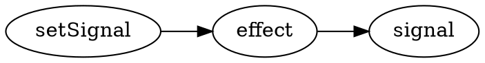

# Project {.columns-2}

::: {.break-inside-avoid .border .rounded-xl .p-4 .shadow-md}
### Instructions

- Individual project, will be used for Mobile Apps
- Sufficiently interactive
- Authentication
:::

::: {.break-inside-avoid .border .rounded .p-4 .shadow-md}
### Technical constraints

- Fully type-safe, including client-server communications
- Data validation
- Should work fully without JavaScript
- Server-Side Rendering
- Client-Side Routing
- Accessible
- Responsive
- Single-Flight mutations
- Optimistic updates
:::

# Install Node.js {.grid .grid-cols-2 .gap-12}

<Iframe src="https://nodejs.org/en" class="w-full h-full border rounded-xl shadow-xl" />

::: col
### Instructions

- Go to <https://nodejs.org/>
- Download Node.js (LTS version)

:::: info
Node.js is a JavaScript interpreter.
It allows your computer to understand and run JavaScript (outside of the browser).
::::
:::

# Solid JS {.grid .grid-cols-2 .gap-12}

::::: col
To install

``` bash
cd Documents/ECAM/4MIN/web-architecture
npx degit solidjs/templates/ts-tailwindcss my-first-solid-project
```

Then, open `my-first-solid-project` with Visual Code.

- [Tutorial](https://www.solidjs.com/tutorial/introduction_basics)
- [SolidJS in 100 seconds](https://www.youtube.com/watch?v=hw3Bx5vxKl0)
:::::

::::: col
::: question
Why SolidJS?
:::

- Modern
- Syntaxically similar to React
- Easier to explain how it works (no virtual DOM, automatic dependency tracking)
- Primitive based, allows for incremental approach

::: question
What if I want to use something else?
:::

- [React + Next](https://nextjs.org)
- [React + TanStack Start](https://tanstack.com/start/latest) (beta)
- [Svelte + SvelteKit](https://svelte.dev)
- [Qwik + Qwikcity](https://qwik.dev/docs/qwikcity/)
- [Angular + Analog](https://analogjs.org/)
:::::

# TypeScript

<Iframe src="https://www.typescriptlang.org/docs/handbook/typescript-in-5-minutes.html" class="w-full h-full border rounded-xl shadow" />

# Signals {.columns-2}

::::: break-inside-avoid
::: {.definition title="Signal"}
A **signal** is a piece of reactive data,
which when changed,
triggers updates to any parts of your application that depends on it.
:::

::: {.border .rounded-xl .shadow .mx-8 .px-8}
A useful analogy is that of an Excel document.
Changing a cell retriggers calculations,
like below

```javascript {.run framework="solid" hideEditor=true}
import { createSignal } from 'solid-js'

function App() {
  const [cell1, setCell1] = createSignal(13)
  const [cell2, setCell2] = createSignal(17)
  const average = () => (parseInt(cell1()) + parseInt(cell2())) * 5 / 2
  return (
    <table>
      <thead>
        <tr>
          <th>Web (20)</th>
          <th>Mobile</th>
          <th>Average</th>
        </tr>
      </thead>
      <tbody>
        <tr>
          <td>
            <input type="number" value={cell1()} onInput={e => setCell1(e.target.value)} />
          </td>
          <td>
            <input type="number" value={cell2()} onInput={e => setCell2(e.target.value)} />
          </td>
          <td>{average()} %</td>
        </tr>
      </tbody>
    </table>
  )
}
```

The two input fields use a **signal** under the hood,
while the average is a **derived value** from those signals.
When a signal changes,
so does its derived values.
:::
:::::

::::: break-inside-avoid
In SolidJS, signals are created via **createSignal**,
which returns an array of two elements:
a getter and a setter.

$$
\mathtt{const}\, [
\underbrace{\mathtt{value}}_{\text{getter}},\
\underbrace{\mathtt{setValue}}_{\text{setter}}
] = \mathtt{createSignal}
\underbrace{\mathtt{<number>}}_{\text{type hint}}
(\underbrace{\mathtt{'hello'}}_{\text{initial value}})
$$

The type annotation is often not necessary
and can be inferred by TypeScript.

::: example
```javascript {.run}
import { createSignal } from 'solid-js'

const [count, setCount] = createSignal(0)
for (let i = 1; i <= 5; i++) {
  setCount(i)
  console.log('Count is now', count())
}
```
:::
:::::

# Derived state {.columns-2}

::::: break-inside-avoid
::: definition
A **derived value** is a value which is purely calculated from at least one signals.
When a dependent signal change,
the derived value should be recalculated.
:::

As SolidJS signals are functions,
a **derived value** in SolidJS is simply a function
which returns a value directly calculated from a signal.
:::::

::::: break-inside-avoid
```javascript {.run}
import { createSignal } from 'solid-js'

// Signal
const [count, setCount] = createSignal(0)

// Derived
function doubleCount() {
  return count() * 2
}

// Derived (arrow syntax)
const tripleCount = () => count() * 3

// Check they are kept in sync
console.log(count(), doubleCount(), tripleCount())
setCount(5)
console.log(count(), doubleCount(), tripleCount())
```
:::::

# Effects {.grid .grid-cols-2}

::: col
::::: definition
An **effect** is a function that runs whenever its dependent signals change.
:::::

::::: {.grid .grid-cols-2}
:::: col
Effects are used

- To fetch data
- To update the DOM
- To trigger animations
- ...
::::

```javascript {.run framework="solid" hideEditor=true}
import { createSignal, createResource, Show } from 'solid-js'

async function loadPokemonImage(name) {
  const url = 'https://pokeapi.co/api/v2/pokemon/'
  try {
    const res = await fetch(url + name)
    const data = await res.json()
    return data.sprites.other['official-artwork']['front_default']
  } catch {
    return ''
  }
}

function App() {
  const [name, setName] = createSignal('pikachu')
  const [src] = createResource(name, loadPokemonImage)
  return (
    <>
      <p><input value={name()} onInput={e => setName(e.target.value)} /></p>
      <Show when={src()} fallback="Loading..."></Show>
    </>
  )
}
```
:::::

In the Pokemon example,
effects are used

- to synchronise the input value with state value
- to fetch the image and update the DOM every time the Pokemon name changes
:::

::: col
### In SolidJS

`createEffect(fn)` executes `fn` and re-executes it every time
one of the inner signals changes.

```typescript {.run}
import { createEffect, createSignal } from 'solid-js'

const [count, setCount] = createSignal(0)

createEffect(() => {
  // Since this effect contains count(),
  // It will be re-executed every time setCount is called
  console.log('Count is now', count())
})

for (let i = 1; i <= 5; i++) {
  setCount(i)
}
```
:::

# JSX

JSX is a syntax extension to JavaScript
that allows DOM manipulation in a syntax resembling HTML.

- Signals and derived values are automatically updated (via effects)

::::: {.grid .grid-cols-2}
``` javascript
const title = <h1>hello {name()}</h1>
```

```javascript
const title = document.createElement('h1')
createEffect(() => title.textContent = 'hello ' + name())
```
:::::

- Unknown tags become function calls

::::: {.grid .grid-cols-2}
```javascript
<Sidebar prop={value} otherProp={otherValue} />
```

```javascript
Sidebar({ prop: value, otherProp: otherValue })
```
:::::

- Children are passed as attributes

::::: {.grid .grid-cols-2}
```javascript
<Parent parentProp={parentVal}>
  <Child prop={value} />
  <OtherChild />
</Parent>
```
```javascript
Parent({
  parentProp: parentVal,
  children: [Child({ prop: value }), OtherChild]
})
```
:::::

# JSX in practice: differences with HTML

- **Close all tags**:
  use a slash at the end of self-contained tags such as ``.

- **One root element**:
  if you need multiple tags,
  you can wrap them into a *fragment* `<></>`:

::::: {.grid .grid-cols-2}
```javascript
<>
  <Child prop={value} />
  <OtherChild />
</>
```
```javascript
Fragment({
  children: [Child({ prop: value }), OtherChild]
})
```
:::::

- **Use curly braces** for JavaScript expressions
  and **camel case** for attributes,
  e.g. `<input value={name()} onInput={e => setName(e.target.value)} />`

# Components {.w-2--3}

::: {.definition title="JSX Element"}
A **component** is a function which returns JSX.
:::

```typescript {.run framework="solid"}
import { createSignal } from 'solid-js'

type Props = {
  initialValue: number
  increment: number
}

function Counter(props: Props) {
  const [count, setCount] = createSignal(props.initialValue)
  const increase = () => setCount(count() + props.increment)
  return (
    <button onClick={increase}>{count()}</button>
  )
}

const App = () => <Counter initialValue={7} increment={2} />
```

# Children: example

```typescript {.run framework="solid" .grid .grid-cols-2 .gap-12}
import type { JSX } from "solid-js"

type CVLineProps = {
  date: string
  school: string
  title: string
  children: JSXElement
}

const CVLine = (props: CVLineProps) => (
  <div>
    <h3>{props.title} ({props.school}, {props.date})</h3>
    {props.children}
  </div>
)

const App = () => (
  <CVLine date="2023-2025" school="ECAM" title="MEng in Industrial Engineering">
    <ul>
      <li>Grade: <em>cum laude</em></li>
      <li>Favourite class: Web Architecture</li>
    </ul>
  </CVLine>
)
```

# Conditional rendering

```typescript {framework="solid" .run .grid .grid-cols-2 .gap-12}
import { createSignal } from 'solid-js'

function App() {
  const [name, setName] = createSignal('')
  return (
    <>
      <p>What is your name?</p>
      <input value={name()} onInput={e => setName(e.target.value)} />
      <Show when={name()} fallback={<p>No name supplied</p>}>
        <p>Hi {name()}!</p>
      </Show>
    </>
  )
}
```

# Loops

```typescript {framework="solid" .run .grid .grid-cols-2 .gap-12}
import { createSignal, For } from 'solid-js'

function App() {
  const [task, setTask] = createSignal('')
  const [tasks, setTasks] = createSignal<string[]>([])
  function addTask() {
    setTasks([...tasks(), task()])
    setTask('')
  }
  return (
    <>
      <input value={task()} onInput={e => setTask(e.target.value)} />
      <button onClick={addTask}>Submit</button>
      <ul>
        <For each={tasks()}>
          {task => <li>{task}</li>}
        </For>
      </ul>
    </>
  )
}
```

# Styling

When you set up SolidJS,
you also installed **tailwindcss**,


```javascript {.run framework="solid" .grid .grid-cols-2 .gap-12 tailwind=true}
const App = () => (
  <p class="border rounded-xl p-4 shadow-lg hover:bg-slate-100">
    Hello!
  </p>
)
```

- [Official website](https://tailwindcss.com/)
- [Documentation](https://tailwindcss.com/docs/styling-with-utility-classes)
- [Intro to Tailwind in 100 seconds](https://www.youtube.com/watch?v=mr15Xzb1Ook)

# Exercises {.columns-2}

::: exercise
Implement a tic-tac-toe with the following requirements.

- At least two components: `Square`, `Board`
- History of all the moves
- Type safe
:::

::: exercise
Implement the [Wordle](https://www.nytimes.com/games/wordle/index.html) game.
:::

# JavaScript frameworks {.w-1--2}

::: question
What are the benefits and drawbacks of using JavaScript frameworks
to design User Interfaces?
:::

::: warning
This is an exam question.
:::

# Key Idea {.w-1--2}

```typescript
createEffect(function effect() {
  console.log(signal(), 'has changed')
})
```



#. `signal()` bust be aware that it is inside `effect`,
   and keep a list of subscribed effects.

#. When calling `setSignal`,
   we need to rerun all the subscribed effects.

# Implementing `createEffect` {.grid .grid-cols-2}

```typescript
const running = []

function createEffect(effect) {
  function wrappedEffect() {
    running.push(wrappedEffect)
    fn()
    running.pop()
  }
  wrappedEffect()
}
```

::: col
- We keep a LIFO stack of running effects (i.e. `running`).
  To know which effect is currently running,
  we can check the element at the top of the stack,
  i.e. `running[running.length - 1]`.

- When creating an effect,
  we change it so that it pushes itself on and off the stack.
:::

# Implementing `createSignal` {.grid .grid-cols-2}

```typescript
function createSignal(value) {
  const subscribers = new Set()
  function getter() {
    if (running) {
      subscribers.add(running[running.length - 1])
    }
    return value
  }
  function setter(newValue) {
    value = newValue
    subscribers.map(effect => effect())
  }
  return [getter, setter]
}
```

::: col
- `createSignal` must return a getter and a setter,
  which will get or set `value`.

- The getter will check if it's running inside an effect.
  If so, it will add it to its subscribers.

  ```typescript
  createEffect(function effect() {
    console.log(signal(), 'has changed')
  })
  ```

  In the example above,
  when `signal()` is executed,
  it is aware of effect
  and adds it to its subscribers.

- When the setter is called,
  it runs all the subscribed effects.
:::

# Prop drilling

# Context