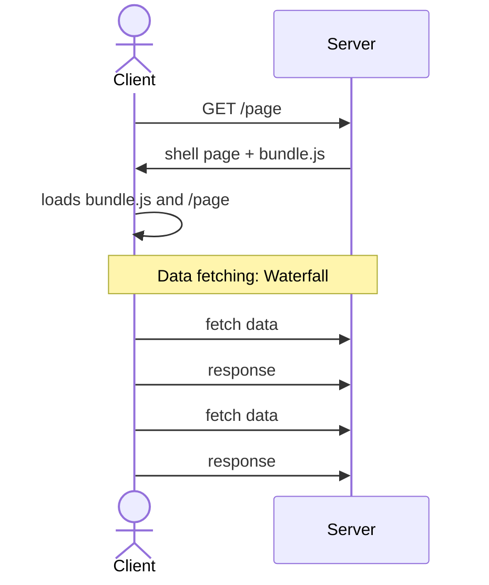

# Single-Page applications {.grid .grid-cols-2}

::::: column
::: question
What is a Single Page application?
:::

- An SPA has a single entry point

- The page is never fully recreated from scratch,
  and is only transformed to reflect state changes.
  Navigation (links, forms, etc.) is faked.
:::::

::::: column
::: question
Why do we do this?
:::

- Better UX

- Faster after the initial load

- Allows data (API) / markup (HTML) separation,
  which is better when developping for multiple clients.

- Because React made it easier than anything else.
:::::

# In practice with Solid {.grid .grid-cols-2}

```typescript
import { Router, Route } from "@solidjs/router"

import Home from "./routes/index"
import About from "./routes/about"

function App() {
  return (
    <Router>
      <Route path="/" component={Home} />
      <Route path="/about" component={About} />
    </Router>
  )
}
```

::::: col

- Install SolidJS's router

  ```bash
  npm install @solidjs/router
  ```

- Each page is a component,
  and is associated with a particular path.

::: remark
You don't need to do this.
We'll set up Solid Start,
which will set up **file based-routing**.
:::
:::::

# Single-Page Applications: drawbacks {.grid .grid-cols-2}



::: column
- The server returns a "shell page" (i.e. blank)
  and a large JavaScript bundle no matter which page is requested
  (can be improved via code-splitting)

  This is **bad for SEO**.

- The client loads the app,
  which itself navigates to the requested page.
  Navigation is thus done on the **client**,
  and so needs to be implemented in your app
  (links, redirection, etc, form.).

  This **breaks usual practices**.
  If you are not careful,
  your app might have **poor accessibility**.

- After the data is fully loaded,
  it will ask for the extra data it needs.

  This leads to **waterfalls**,
  and a slow first render.
:::

# Server-Side Rendering {.w-1--2}

::: {.definition title="Server-Side Rendering"}
Server-Side Rendering is a technique which consists
in executing a Single Page App on the server
(to get HTML instead of changing the DOM)
for the first render.

That HTML page is then transformed into a Single-Page application
by a process called **hydration**.
:::

- This solves the SEO problem

- This implies using JavaScript/TypeScript on both sides.
  This is not a bad thing,
  as we can share code (e.g. validation).

- Most of your app needs to be executable on both sides.

- After the first load,
  the website behaves like a Single-Page application.

# Solid-Start {.w-1--2}

We'll use the Solid-Start **metaframework**,
which has the following functionalities.

- **SSR**: execute SolidJS on the server to get a first render

- **Runtime**: Database interactions, etc.

- **Data-fetching/caching**: link between front-end and backend.

- **Routing**: unified way of dealing with "real" and "fake" navigation.

::: info
The React's closest equivalent is **Next.js**.
:::

# Solid-Start: Getting started {.w-1--2}

```bash
npm create solid
```

- SolidStart project: yes

- `with-tailwindcss`

- Use TypeScript? yes

# SSR {.w-1--2}

- We get that for free with Solid-Start

- Unified way to create UI!

::: remark
Some components will not work on the server
(because they rely too much on the DOM),
if you are in the situation,
import these components with [clientOnly](https://docs.solidjs.com/solid-start/reference/client/client-only).
:::

# File-Based routing {.w-1--2}

Solid-start handles routing client and server-side.

- `public/`: files to be served as is.
  For example, `public/folder/image.png` will be accessible at the URL `/folder/image.png`.

- `src/routes`: File-based routing

| URL                | file                                                       |
| ------------------ | ---------------------------------------------------------- |
| `/contact`         | `src/routes/contact.tsx` or `src/routes/contact/index.tsx` |
| `/blog/article-1`  | `src/routes/blog/article-1.tsx`                            |
| `/users/:id`       | `src/routes/users/[id].tsx`                                |
| `/users/:id/:name` | `src/routes/users/[id]/[name].tsx`                         |
| `/blog/*`          | `src/routes/blog/[...post].tsx`                            |

[Documentation](https://docs.solidjs.com/solid-start/building-your-application/routing)

# Routes {.w-1--2}

Example: `routes/users/[id].tsx`

```typescript
import { useParams } from '@solidjs/router'
import type { APIEvent } from '@solidjs/start/server'

// Example of an API Route for the POST endpoint
export function POST(event: APIEvent) {
  return {
    msg: 'hello world',
    foo: true,
  }
}

// UI routes: for 'pages'
export default function NameItWhateverYouWant() {
  const params = useParams()
  return (
    <div>User {params.id}</div>
  )
}
```

- [Documentation: API route](https://docs.solidjs.com/solid-start/building-your-application/api-routes)

# Metadata {.w-1--2}

Install `@solidjs/meta` via `npm install @solidjs/meta`.

```typescript
import { Meta, Title } from "@solidjs/meta";

export default function About() {
  return (
    <>
      <Title>About</Title>
      <Meta name="description" content="This is my content tag." />
      <h1>About</h1>
    </>
  )
}
```

[Documentation: head and metadata](https://docs.solidjs.com/solid-start/building-your-application/head-and-metadata)

# Server functions {.w-1--2}

::::: col
```typescript
function getPosts() {
  'use server'
  // code here...
}
```

A function marked with _'use server'_ will only run on the server.

- If called on the server side, it will run as-is;
- On the client, it will be an API request.

This has huge benefits, including preserving **type safety**.

::: remark
Remember server functions are API calls,
always **sanitize the client's input**!
:::
:::::

# Data fetching {.grid .grid-cols-2}

::::: col
```typescript
import { ErrorBoundary, Suspense, For } from 'solid-js'
import { query, createAsync, type RouteDefinition } from '@solidjs/router'

const getPosts = query(async () => {
  'use server'
  // Your logic
}, 'posts')

export const route = {
  preload: () => getPosts(),
} satisfies RouteDefinition

export default function Page() {
  const posts = createAsync(() => getPosts())
  return (
    <ul>
      <ErrorBoundary fallback={<div>Something went wrong!</div>}>
        <Suspense fallback={<div>Loading...</div>}>
          <For each={posts()}>{(post) => <li>{post.title}</li>}</For>
        </Suspense>
      </ErrorBoundary>
    </ul>
  )
}
```
:::::

::::: col
- `query` creates a cached function,
  'posts' is supplied as a cache key.
  Cached functions won't be called twice during the lifetime of the request.

- Lines 9-11: ensure `getPosts` gets preloaded before the
  component is rendered
  to avoid waterfalls.

  Preloads are also triggered when hovering links.

- We now wrap async functions with `createAsync`
  (rather than `createResource`),
  as it works better with caching.

- As usual, fetched data should be wrapped by an error boundary
  and Suspense.
:::::

# Caching {.w-1--2}

The issue with caching is it might display out-of-date data.

```typescript
import { revalidate } from '@solidjs/router'

export const getTasks = async () => {
  'use server'
  // your code here
}

export const addTask = async (task: Task) => {
  'use server'
  // your code here
  revalidate(getTasks.key)
}
```

- [Revalidate](https://docs.solidjs.com/solid-router/reference/response-helpers/revalidate)
- [Reload](https://docs.solidjs.com/solid-router/reference/response-helpers/reload)

# Start your project

- Structure your project clearly, e.g.:

  - `src/components`: put all components here
  - `src/lib`: server code and other helpers
  - `src/routes`: your page

# Components {.flex}

::::: {.w-2--3}
```typescript
import { type JSXElement } from 'solid-js'

type Props = {
  class?: string
  onClick?: () => void
  variant?: 'contained' | 'outlined'
  children: JSXElement
}

export default function Button(props) {
  return (
    <button
      onClick={() => props.onClick?.()}
      class={props.class}
      classList={{
        'rounded-xl p-2': true,
        'bg-green-500 text-white': props.variant !== 'outlined',
        'border border-green-500 text-green-500': props.variant === 'outlined',
      }}
    >
      {props.children}
    </button>
  )
}
```
:::::

::::: col
- Make your components small and customizable.
- Expose the `class` props for tailwind customization
- Avoid code repetition if possible
:::::

# Databases {.w-1--2}

We'll use [Prisma](https://www.prisma.io/).

```typescript
npm install prisma --save-dev
```

- [Quickstart](https://www.prisma.io/docs/getting-started/quickstart-prismaPostgres)
- [Schema](https://www.prisma.io/docs/orm/prisma-schema)
- [Basic queries](https://www.prisma.io/docs/orm/prisma-client/queries/crud)