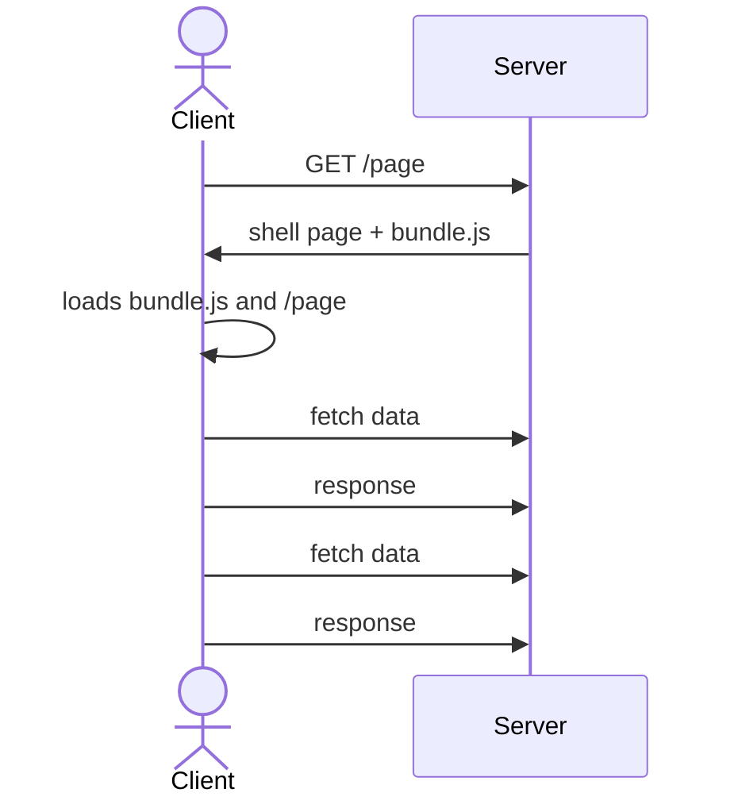

# Single-Page applications {.grid .grid-cols-2}

::::: column
::: question
What is a Single Page application?
:::

- An SPA has a single entry point

- The page is never fully recreated from scratch,
  and is only transformed to reflect state changes.
  Navigation (links, forms, etc.) is faked.
:::::

::::: column
::: question
Why do we do this?
:::

- Better UX

- Faster after the initial load

- Allows data (API) / markup (HTML) separation,
  which is better when developping for multiple clients.
:::::

# Single-Page Applications: drawbacks {.grid .grid-cols-2}



::: column
- The server returns a "shell page" (i.e. blank)
  and a large JavaScript bundle no matter which page is requested
  (can be improved via code-splitting)

  This is **bad for SEO**.

- The client loads the app,
  which itself navigates to the requested page.
  Navigation is thus done on the **client**,
  and so needs to be implemented in your app
  (links, redirection, etc, form.).

  This **breaks usual practices**.
  If you are not careful,
  your app might have **poor accessibility**.


- After the data is fully loaded,
  it will ask for the extra data it needs.

  This leads to **waterfalls**,
  and a slow first render.
:::

# Server-Side Rendering {.w-1--2}

::: {.definition title="Server-Side Rendering"}
Server-Side Rendering is a technique which consists
in executing a Single Page App on the server
(to get HTML instead of changing the DOM)
for the first render.

That HTML page is then transformed into a Single-Page application
by a process called **hydration**.
:::

- This solves the SEO problem

- This implies using JavaScript/TypeScript on both sides.
  This is not a bad thing,
  as we can share code (e.g. validation).

- Most of your app needs to be executable on both sides.

- After the first load,
  the website behaves like a Single-Page application.

# Solid-Start {.w-1--2}

We'll use the Solid-Start **metaframework**,
which has the following functionalities.

- **SSR**: execute SolidJS on the server to get a first render

- **Runtime**: Database interactions, etc.

- **Data-fetching**: link between front-end and backend.

- **Routing**: unified way of dealing with "real" and "fake" navigation.

::: info
The React's closest equivalent is **Next.js**.
:::

# Solid-Start: Getting started {.w-1--2}

```bash
npm create solid
```

- SolidStart project: yes

- `with-tailwindcss`

- Use TypeScript? yes

# File-Based routing {.w-1--2}

- `public/`: files to be served as is.
  For example, `public/folder/image.png` will be accessible at the URL `/folder/image.png`.

- `src/routes`: File-based routing

| URL                | file                                                       |
| ------------------ | ---------------------------------------------------------- |
| `/contact`         | `src/routes/contact.tsx` or `src/routes/contact/index.tsx` |
| `/blog/article-1`  | `src/routes/blog/article-1.tsx`                            |
| `/users/:id`       | `src/routes/users/[id].tsx`                                |
| `/users/:id/:name` | `src/routes/users/[id]/[name].tsx`                         |
| `/blog/*`          | `src/routes/blog/[...post].tsx`                            |

[Documentation](https://docs.solidjs.com/solid-start/building-your-application/routing)

# Routes {.w-1--2}

Example: `routes/users/[id].tsx`

``` typescript
import { useParams } from '@solidjs/router'
import type { APIEvent } from '@solidjs/start/server'

// Example of an API Route for the GET endpoint
export function GET(event: APIEvent) {
  return {
    msg: 'hello world',
    foo: true,
  }
}

// UI routes: for 'pages'
export default function NameItWhateverYouWant() {
  const params = useParams()
  return (
    <div>User {params.id}</div>
  )
}
```

- [Documentation: API route](https://docs.solidjs.com/solid-start/building-your-application/api-routes)

# Layout

TODO

# Metadata {.w-1--2}

Install `@solidjs/meta` via `npm install @solidjs/meta`.

```typescript
import { Meta, Title } from "@solidjs/meta";

export default function About() {
  return (
    <>
      <Title>About</Title>
      <Meta name="description" content="This is my content tag." />
      <h1>About</h1>
    </>
  )
}
```

[Documentation: head and metadata](https://docs.solidjs.com/solid-start/building-your-application/head-and-metadata)

# Data fetching {.grid .grid-cols-2}

::::: col
``` typescript
import { ErrorBoundary, Suspense, For } from 'solid-js'
import { query, createAsync, type RouteDefinition } from '@solidjs/router'

const getPosts = query(async () => {
  const posts = await fetch('https://my-api.com/posts')
  return await posts.json()
}, 'posts')

export const route = {
  preload: () => getPosts(),
} satisfies RouteDefinition

export default function Page() {
  const posts = createAsync(() => getPosts())
  return (
    <ul>
      <ErrorBoundary fallback={<div>Something went wrong!</div>}>
        <Suspense fallback={<div>Loading...</div>}>
          <For each={posts()}>{(post) => <li>{post.title}</li>}</For>
        </Suspense>
      </ErrorBoundary>
    </ul>
  )
}
```
:::::

::::: col
- `query` creates a cached function,
  'posts' is supplied as a cache key.
:::::