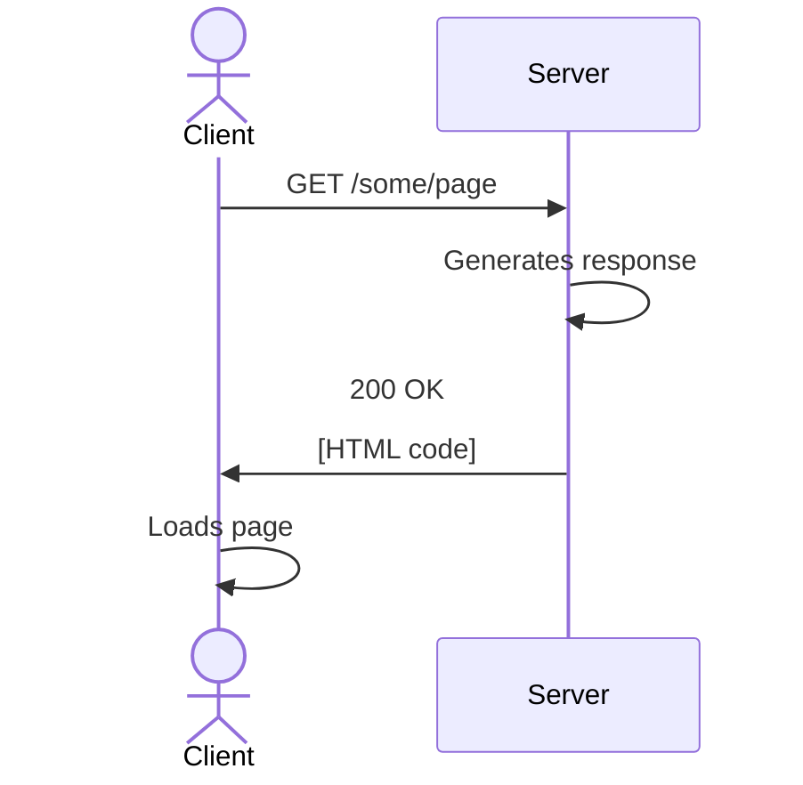

# Architecture: MPA {.grid .grid-cols-2}

::::: column

:::::

::::: column
## Multi-Page Applications

- The client sends a **request** to the server.
  Two common types of requests:

  - `GET /some/page` to see a page or a file at that particular URL
  - `POST /some/page` to send form data

- The server analyses the request, generates a **response**,
  and sends it back to the client.

- The client reacts to the server's request,
  generally with a **full page reload**.

::: remark
Next.js doesn't actually work like this
and allows much more powerful and complex patterns.
:::
:::::

# Todo App (data) {.grid .grid-cols-2}

::::: column
`lib/tasks.ts`

~~~ tsx
'use server'

import { headers } from 'next/headers'
import { redirect } from 'next/navigation'

const tasks: { title: string; done: boolean; }[] = []

export async function getTasks() {
  return tasks
}

export async function createTask(form: FormData) {
  tasks.push({
    title: String(form.get('title')),
    done: false,
  })
  redirect((await headers()).get('referer') ?? '/')
}
~~~
:::::

::: column
- `use server`:
  ensures the bodies of the functions are only run on the server.
  Exported functions are nevertheless accessible on the client,
  that's why they are marked as 'async',
  as client/server communication can take time.

- An **async** function is one that can be paused and resumed later
  because we are waiting for a long running task.
  The aim is to ensure that the main thread is not stuck
  during the execution of the function.

  It essentially means: *you can do something else every time an instruction starts with `await`*.

- `redirect(...)` ensures the page is reloaded.
  In traditional web development,
  forms always reload the page or load a new one.
  Next.js allows more control by default,
  as modern applications tend to avoid full page reloads.

::::: warning
Always validate data coming from a form.
:::::
:::

# Async function {.grid .grid-cols-2}

::: col
~~~ ts
// Async means that the function can be paused
async function eatCheeseburger() {
  goToMcDonalds()
  // Execution of the function is paused now because there is an 'await'
  // It will resume again *after* the order is finished
  const food = await order('cheeseburger')
  eat(food)
}
~~~

Guess in what order the `console.log` will run.

~~~ ts {.run}
async function someAsyncFunction() {
  console.log("I'm hungry")
  await new Promise(r => setTimeout(r, 1000));
  console.log("I'm bored")
}

someAsyncFunction()
console.log("I'm sleepy")
~~~
:::

::: col
- A function marked as `async` means that it can be paused during its execution
  and yield back to the main thread.
  Async functions return a **promise of a response**.

  In other words, `async` means:
  *In this function every time you see `await`, you are free to do other things*

- On L3, there is a an `await`,
  so the main thread gets a promise of a response (like a receipt in MacDonalds)
  and pauses the execution of the function `eatCheeseburger`
  to do something else.
  When the promise is resolved (i.e. when the cheeseburger is ready) and whenever it can,
  it resumes execution of the function.

  More simply, `await` means:
  *this will take some time, go do something else and return later*.
:::

# Todo App (view) {.grid .grid-cols-2}

::: col
~~~ tsx
import { createTask, getTasks } from '@/lib/tasks'

export default async function TodoApp() {
  const tasks = await getTasks()
  return (
    <>
      <form action={createTask}>
        <label>
          New task: <input name="title" />
        </label>
        <button>Submit</button>
      </form>
      <ul>
        {tasks.map((task, id) => (
          <li>{task.title}</li>
        ))}
      </ul>
    </>
  )
}
~~~
:::

::: col
:::

# Deleting task {.grid .grid-cols-2}

::::: col
~~~ tsx
'use server'

import { headers } from 'next/headers'
import { redirect } from 'next/navigation'

const tasks: { title: string; done: boolean; }[] = []

export async function getTasks() {
  return tasks
}

export async function createTask(form: FormData) {
  tasks.push({
    title: String(form.get('title')),
    done: false,
  })
  redirect((await headers()).get('referer') ?? '/')
}

export async function deleteTask(id: number) {
  tasks.splice(id, 1)
  redirect((await headers()).get('referer') ?? '/')
}
~~~
:::::

::: col
~~~ tsx
import { createTask, getTasks } from '@/lib/tasks'
export default async function TodoApp() {
  const tasks = await getTasks()
  return (
    <>
      <form action={createTask}>
        <label>
          New task: <input name="title" />
        </label>
        <button>Submit</button>
      </form>
      <ul>
        {tasks.map((task, id) => (
          <>
            <li>{task.title}</li>
            <button formAction={deleteTask.bind(null, id)}>
              Delete task
            </button>
          </>
        ))}
      </ul>
    </>
  )
}
~~~
:::

# Personal website: Blog {.columns-2}

::::: break-inside-avoid
::: exercise
Add a blog to your personal website.
:::

- `lib/blog.ts`: should follow the following structure:

   ~~~ tsx
   'use server'

   export async function getPosts() { }

   export async function getPost(id: number) { }

   export async function createPost(form: FormData) { }

   export async function editPost(form: FormData) { }

   export async function deletePost(id: number) { }
   ~~~
:::::

- `app/blog/page.ts`: list all blog posts (with `getPosts()`).
  Should provide a button to delete a blog post.

- `app/blog/[id]/page.ts`: show one blog post.
  To extract the `id`,
  use the following

  ~~~ tsx
  type BlogPostPageProps = {
    params: Promise<{ id: string }>
  }

  export default async function BlogPostPage(props: BlogPostPageProps) {
    const id = Number((await props.params).id)
    const post = await getPost(id)
    // ...
  }
  ~~~

- `app/blog/edit/[id]/page.ts`: a form to edit the blog post

- `app/blog/new/page.ts`: a form to create a new blog post.

# Deployment with Docker {.w-1--2}

::: definition
Docker is a tool that lets you package an application and its dependencies into a container
so that it **runs the same way everywhere**.
:::

Term            Explanation
-----           ------------
Image           Blueprint for a container
Container       Running instance of an image
Dockerfile      Recipe for building your own image
Docker Hub      Public library of images

# Deployment with Docker {.grid .grid-cols-2}

::::: col
Copy-paste the following in `Dockerfile`:

~~~ dockerfile
FROM node:lts
EXPOSE 3000

WORKDIR /app

COPY package*.json ./
RUN npm install

COPY . .
RUN npm run build

CMD ["npm", "start"]
~~~

::: info
- Build your image: `docker build -t my-website .`
- Run it: `docker run -p 3000:3000 my-website`
:::
:::::

::::: col
- `FROM`: We start from a basic Docker image containing **Node.js**

- `EXPOSE`: We specify which port we'll use.
  Next.js uses 3000.

- `WORKDIR`: specify the current working directory within the Docker image.

- `COPY`: to copy file from the project to the container

- `RUN`: runs a command within the container
:::::

# Docker Compose {.columns-2}

::: definition
Docker compose is a tool that lets you define and run multi-container Docker applications.
:::

docker-compose.yaml:

~~~ yaml
services:
  web:
    build: .
    ports:
      - "3000:3000"
~~~

::: info
- `docker compose up --build` to build and start your application
- `docker compose down` to stop it
:::

::: remark
This will be particularly useful later when we have a database.
:::

# Install Docker on your VM

On your machine, run the following commands

~~~ bash
sudo apt update
sudo apt install ca-certificates curl
sudo install -m 0755 -d /etc/apt/keyrings
sudo curl -fsSL https://download.docker.com/linux/ubuntu/gpg -o /etc/apt/keyrings/docker.asc
sudo chmod a+r /etc/apt/keyrings/docker.asc
sudo tee /etc/apt/sources.list.d/docker.sources <<EOF
Types: deb
URIs: https://download.docker.com/linux/ubuntu
Suites: $(. /etc/os-release && echo "${UBUNTU_CODENAME:-$VERSION_CODENAME}")
Components: stable
Signed-By: /etc/apt/keyrings/docker.asc
EOF
sudo apt update
sudo apt install docker-ce docker-ce-cli containerd.io=1.7.28-1~ubuntu.24.04~noble docker-buildx-plugin docker-compose-plugin
sudo service docker start
~~~

# Set up your VM {.w-1--2}

- SSH into your Virtual machine (via Putty or equivalent)

- **Install docker** (see previous slide)

- Set up a **reverse proxy** so that Apache forwards traffic from the port 80 to 3000.

- Edit `/etc/apache2/sites-available/000-default.conf`:

  ~~~ txt
  <VirtualHost *:80>
    ProxyPass / http://127.0.0.1:3000/
    ProxyPassReverse / http://127.0.0.1:3000/
  </VirtualHost>
  ~~~

- Enable the `proxy` and `proxy_http` modules and restart Apache

  ~~~ bash
  sudo a2enmod proxy
  sudo a2enmod proxy_http
  sudo systemctl restart apache2
  ~~~

# Deployment {.w-1--2}

~~~ bash
git clone <repo_url>
cd <repo_dir>
docker compose up --build
~~~

Make sure the above script is executable (`chmod +x`).

# Checklist {.w-1--2}

- Can I create a simple CRUD (Create, Read, Update, Delete) app without a database?

- Do I know what an *async* function is?

- Can I deploy my website with Docker?

- Can I deploy it automatically with a post-receive hook?
