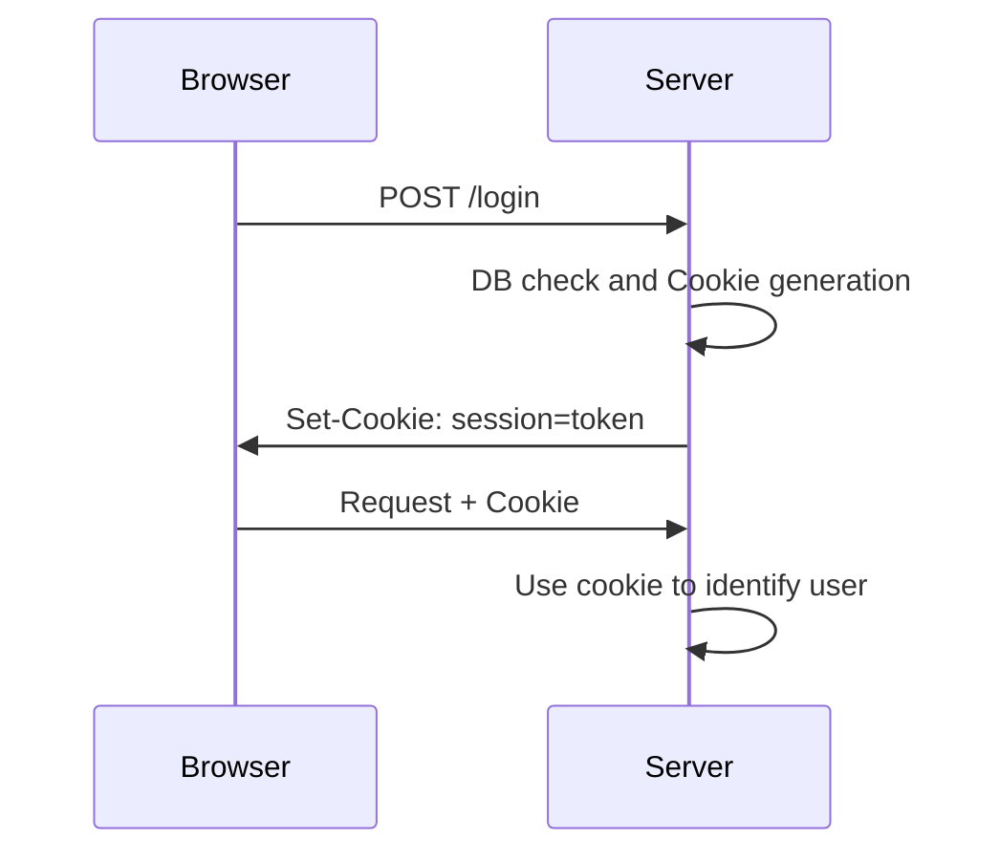

# Hashing {.w-1--2}

For security reasons,
we do not want to store users' passwords.

```{.js .run tailwind=true framework="solid" runImmediately=true hideEditor=true}
import { createSignal, createResource } from 'solid-js'

async function sha256(message: string) {
  const msgBuffer = new TextEncoder().encode(message)
  const hashBuffer = await crypto.subtle.digest('SHA-256', msgBuffer)
  const hashArray = Array.from(new Uint8Array(hashBuffer))
  const hashHex = hashArray.map((b) => b.toString(16).padStart(2, '0')).join('')
  return hashHex
}

function App() {
  const [string, setString] = createSignal('Bonjour')
  const [hashed] = createResource(string, (str) => sha256(str))
  return (
    <div class="text-2xl">
      <label>
        String: <input class="border p-2" onInput={(e) => setString(e.target.value)} value={string()} />
      </label>
      <p>
        Hash (SHA-256):<br />
        <code>
          <small>{hashed()}</small>
        </code>
      </p>
    </div>
  )
}
```

Hash functions are one-way but deterministic,
they will always give the same output for the same input.


# Authentication process {.grid .grid-cols-2}

::::: break-inside-avoid
```{.js .run tailwind=true framework="solid" runImmediately=true hideEditor=true}
import { createSignal, createResource } from 'solid-js'
import bcrypt from 'bcryptjs'

const info = [
  { login: 'tuxie', password: 'hello' },
  { login: 'lily', password: 'snake' },
  { login: 'choco', password: 'hello' },
  { login: 'bacon', password: 'hello' },
  { login: 'emma', password: 'ilovetuxie' },
]

function App() {
  const [login, setLogin] = createSignal('')
  const [password, setPassword] = createSignal('')
  const [users] = createResource(() => {
    return Promise.all(
      info.map(async (u) => ({...u, password: await bcrypt.hash(u.password, 10) }))
    )
  })
  const user = () => users()?.filter(u => u.login === login())?.[0]
  const salt = () => user()?.password.substring(0, 29)
  const hash = () => user()?.password.substring(29, user()?.password.length)
  const [hashed] = createResource(() => [password(), salt()], async ([str, s]) => {
    if (str && s) {
      return await bcrypt.hash(str, s)
    }
    return ''
  })
  return (
    <>
      <table>
        <thead>
          <tr>
            <th>Login</th>
            <th>Password: <code>salt + hash(salt + password)</code></th>
          </tr>
        </thead>
        <tbody>
          {users()?.map(u => (
            <tr>
              <td class="px-2 py">{u.login}</td>
              <td class="px-2 py"><code>{u.password}</code></td>
            </tr>
          ))}
        </tbody>
      </table>
      <div class="my-4">
        <label>
          Login: <input class="border" value={login()} onInput={e => setLogin(e.target.value)} />
        </label>
      </div>
      <div>
        {user() && <>
          <ul>
            <li>Login: {user()?.login}</li>
            <li>Salt: <code>{salt()}</code></li>
            <li>Hash: <code>{hash()}</code></li>
          </ul>
        </>}
      </div>
      {user() && <div class="my-4">
        <div>
          Password: <input class="border" value={password()} onInput={e => setPassword(e.target.value)} />
        </div>
        <div>
          Hashed: <code>{hashed()}</code>
        </div>
        {hashed() == user()?.password && <p class="text-green-800 my-2">Login and password are correct</p>}
      </div>}
    </>
  )
}
```
:::::

::::: break-inside-avoid
- Passwords are **salted** (prefixed with a pseudorandom string) then **hashed**.

- In the database, we generally store the concatenation of salt and hash.

  $$
  \text{storedPassword}
  = \text{salt} + \text{hash}(\text{salt} + \text{password})
  $$

- When logging in,
  we apply the same salt, hash the result,
  and check it is the same as `storedPassword`.
:::::

# Session persistence {.grid .grid-cols-2}

::::: break-inside-avoid
::: question
How do we persist sessions after logging in?
:::

We use **cookies**.

::: definition
A cookie is a piece of data that the client sends with every request until expiration.
:::

::: warning
Cookies can be faked.
:::
:::::



# Signed cookie {.w-1--2}

::: definition
A cookie is a piece of data that the client sends with every request until expiration.
:::

Authentication cookies are generally signed to ensure they aren't faked.

$$
\underbrace{\texttt{ngy@ecam.be}}_{\text{value}};
\underbrace{\texttt{6953c8d7890a1ef90d3028be3...}}_{
  \text{Signature} =
  \texttt{hash}(
    \texttt{secret} + \texttt{value}
  )
}
$$

In the above,
you need to know the secret to calculate the signature.

# Database {.w-1--2}

Let's add a `users` table.

~~~ ts
// db/schema.ts
import { pgTable, text, timestamp, uuid } from 'drizzle-orm/pg-core'

// Your other tables...

export const usersTable = pgTable('users', {
  id: uuid().defaultRandom().primaryKey(),
  email: text().notNull().unique(),
  password: text().notNull(),
})
~~~

# Registration {.grid .grid-cols-2}

::: break-inside-avoid
`lib/session.ts`

~~~ ts
'use server'

import { db } from '@/db'
import { usersTable } from '@/db/schema'

export async function register(form: FormData) {
  await db.insert(usersTable).values({
    email: String(form.get('email')),
    password: await hash(String(form.get('email')), 10)
  })
}
~~~
:::

# Cookies {.grid .grid-cols-2}

::::: break-inside-avoid
~~~ ts
'use server'

const secret = process.env.SECRET

async function createSessionCookie(email: password) {
  const signature = await hash(secret + email, 10)
  const cookieStore = await cookies()
  cookieStore.set('session', email + ';' + signature)
}

async function checkSessionCookie() {
  const cookieStore = await cookies()
  const sessionCookie = cookieStore.get('session')
  const [email, signature] = sessionCookie.split(';')
  const correct = await compare(signature, secret + email)
  return correct ? email : null
}
~~~
:::::

::::: break-inside-avoid
- `secret` is an **environment variable** only known to the server.
  You can set it in an `.env` file or via Docker Compose.
  (In the previous session, we defined `DATABASE_URL` in Docker Compose).

- `createSessionCookie` creates a **signed cookie**
  that contains an email.

- `checkSessionCookie` checks that the signature is correct.
:::::

# Loggin in

::::: break-inside-avoid
`lib/session.ts`

~~~ ts
'use server'

import { cookies } from 'next/headers'
import { db } from '@/db'
import { usersTable } from '@/db/schema'

const secret = process.env.SECRET!

export async function login(form: FormData) {
  const user = await db
    .select()
    .from(usersTable)
    .where(eq(usersTable.email, String(form.get('email'))))
  if (!user || await compare(user.password, String(form.get('password')))) {
    return null
  }
  await createSessionCookie(form.get('email'))
}

export async function getUser() {
  const email = await checkSessionCookie()
  const user = await db
    .select()
    .from(usersTable)
    .where(eq(usersTable.email, email))
  return user.at(0) ?? null
}
~~~
:::::
