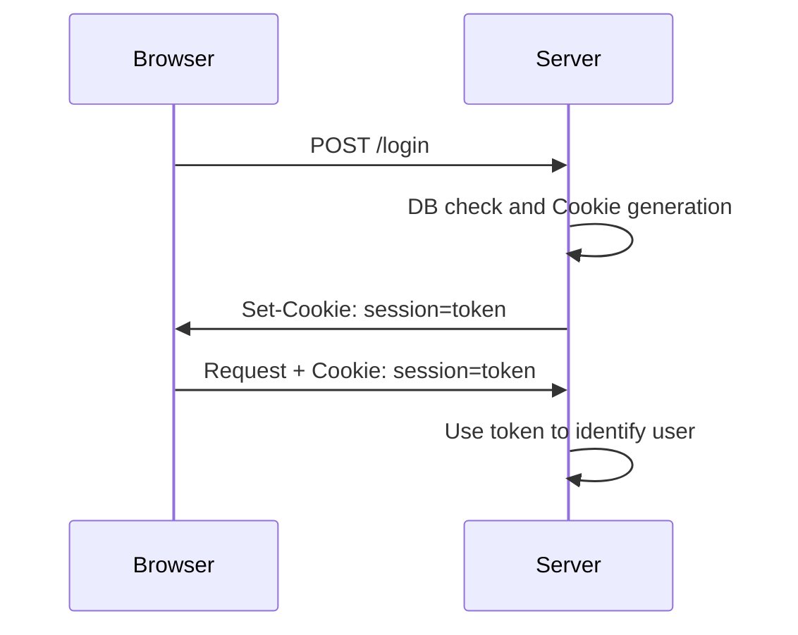

# Authentication {.w-1--2}

- **Registration**:
  The user fills in a form with their desired credentials
  and the server stores them appropriately in the database.
  
  ::: warning
  Storing the actual password in a database is a bad security practice.
  $$\texttt{storedPassword = transform(registrationPassword)}$$
  :::

- **Log in**:
  The users fills in a form with their credentials,
  and the server checks them against the database.

  ::: remark
  Note that passwords are *transformed* before being stored.
  So we check:
  $$\texttt{transform(loginPassword) === storedPassword}$$
  :::

- **Session persistence**:
  after logging in,
  we need to ensure that the server can still differentiate requests from a logged in user,
  without having to ask them to send their passwords over and over again.
  This is done via **cookies**.

# Registration: password hashing

For security reasons,
we do not want to store user passwords.
We'll **hash** them so they are not recognizable.

```{.js .run tailwind=true framework="solid" runImmediately=true hideEditor=true}
import { createEffect, createSignal, createResource, For, Show } from 'solid-js'

async function sha256(message: string) {
  const msgBuffer = new TextEncoder().encode(message)
  const hashBuffer = await crypto.subtle.digest('SHA-256', msgBuffer)
  const hashArray = Array.from(new Uint8Array(hashBuffer))
  const hashHex = hashArray.map((b) => b.toString(16).padStart(2, '0')).join('')
  return hashHex
}

const users = [
  { name: 'lilyTheSausageDog', password: 'chicken', salt: 'random' },
  { name: 'mochiTheStrippingHamster', password: 'poleDancing', salt: 'random2' },
]

function App() {
  const [password, setPassword] = createSignal('chicken')
  const [hash] = createResource(password, (str) => sha256(str))
  const [hashes] = createResource(() => Promise.all(users.map(u => sha256(u.password))))
  return (
    <table class="border mx-auto text-xl">
      <tr>
        <th class="p-4">Login</th>
        <th class="p-4">Password (not stored)</th>
        <th class="p-4">Password (hashed)</th>
      </tr>
      <tbody>
      <For each={users}>
        {(user, i) =>
          <tr class="border-gray-200 border-t hover:bg-slate-100 py-4">
            <td class="p-4">{user.name}</td>
            <td class="text-gray-300 p-2">{user.password}</td>
            <td class="p-4">{hashes() && hashes()[i()]}</td>
          </tr>
        }
      </For>
      <tr class="border-gray-200 border-t hover:bg-slate-100 py-4">
        <td class="p-4">NewUser</td>
        <td>
          <input class="border p-2 text-gray-500" onInput={e => setPassword(e.target.value)} value={password()} />
        </td>
        <td class="p-4">{hash()}</td>
      </tr>
      </tbody>
    </table>
  )
}
```

Unfortunately, this is **not enough**,
as **two people with the same password will have the same hash**.

To remedy that,
we prefix the password with a **random string** (called salt) before hashing:
$$
\texttt{storedPassword} = \texttt{hash(randomSalt + password)}
$$

```{.js .run tailwind=true framework="solid" runImmediately=true hideEditor=true}
import { createEffect, createSignal, createResource, For, Show } from 'solid-js'

async function sha256(message: string) {
  const msgBuffer = new TextEncoder().encode(message)
  const hashBuffer = await crypto.subtle.digest('SHA-256', msgBuffer)
  const hashArray = Array.from(new Uint8Array(hashBuffer))
  const hashHex = hashArray.map((b) => b.toString(16).padStart(2, '0')).join('')
  return hashHex
}

const users = [
  { name: 'lilyTheSausageDog', password: 'chicken', salt: 'random' },
  { name: 'mochiTheStrippingHamster', password: 'poleDancing', salt: 'random2' },
]

function App() {
  const [salt, setSalt] = createSignal('completelyRandom3')
  const [password, setPassword] = createSignal('chicken')
  const [hash] = createResource(() => salt() + password(), (str) => sha256(str))
  const [hashes] = createResource(() => Promise.all(users.map(u => sha256(u.salt + u.password))))
  return (
    <table class="border mx-auto text-xl">
      <tr>
        <th class="p-4">Login</th>
        <th class="p-4">Password (not stored)</th>
        <th class="p-4">Salt (stored)</th>
        <th class="p-4">Password (hashed)</th>
      </tr>
      <tbody>
      <For each={users}>
        {(user, i) =>
          <tr class="border-gray-200 border-t hover:bg-slate-100 py-4">
            <td class="p-4">{user.name}</td>
            <td class="text-gray-300 p-2">{user.password}</td>
            <td class="p-2">{user.salt}</td>
            <td class="p-4">{hashes() && hashes()[i()]}</td>
          </tr>
        }
      </For>
      <tr class="border-gray-200 border-t hover:bg-slate-100 py-4">
        <td class="p-4">NewUser</td>
        <td>
          <input class="border p-2 text-gray-500" onInput={e => setPassword(e.target.value)} value={password()} />
        </td>
        <td>
          <input class="border p-2 text-gray-500" onInput={e => setSalt(e.target.value)} value={salt()} />
        </td>
        <td class="p-4">{hash()}</td>
      </tr>
      </tbody>
    </table>
  )
}
```

# Registration and log in {.grid .grid-cols-2}

~~~ ts
'use server'

import { compare, hash } from 'bcryptjs'

export async function register(form: FormData) {
  const login = String(form.get('login'))
  const password = String(form.get('password'))
  await db.insert(usersTable).values({
    login, // short for login: login
    password: await hash(password, 10),
  })
}

export async function login(form: FormData) {
  const login = String(form.get('login'))
  const password = String(form.get('password'))
  const users = await db.select().from(usersTable)
    .where(eq(usersTable.login, login))
  const loggedIn = users.length > 0
    ? await compare(password, users[0].password)
    : false
  // To be continued... (cookie generation)
}
~~~

::: break-inside-avoid
To save space, we have omitted the usual imports,
and the **schema** of the `users` table.
Ensure the login is **unique** via the
[unique constraint](https://orm.drizzle.team/docs/indexes-constraints#unique),
like this:

~~~ ts
export const usersTable = pgTable('users', {
  id: uuid().defaultRandom().primaryKey(),
  login: text().notNull().unique(),
  password: text().notNull(),
})
~~~

- `bcryptjs` is the library that's going to help us salt and hash passwords.
  To install it, run `npm install bcryptjs`.

- We **salt** and **hash** the password with bcrypt's `hash`.
  The `10` argument is to specify how secure the random salt generation should be.
  The salt will be contained in the hashed password.

- In the `login` function,
  we get the user from the database with the same login,
  and we compared the **hashed (and salted) passwords** with bcrypt's `compare`,
  which return `true` or `false`
  depending on whether the password is correct.
:::

# Session persistence {.grid .grid-cols-2}

::::: break-inside-avoid
::: question
How do we persist sessions after logging in?
:::

We use **cookies**.

::: definition
A cookie is a piece of data that the client sends with every request until expiration.
:::

::: warning
Cookies can be faked.
:::
:::::



# Signed cookie {.w-1--2}

::: definition
A cookie is a piece of data that the client sends with every request until expiration.
:::

Authentication cookies are generally signed to ensure they aren't faked.

$$
\underbrace{\texttt{ngy@ecam.be}}_{\text{value}};
\underbrace{\texttt{6953c8d7890a1ef90d3028be3...}}_{
  \text{Signature} =
  \texttt{hash}(
    \texttt{secret} + \texttt{value}
  )
}
$$

In the above,
you need to know the secret to calculate the signature.

# Login {.grid .grid-cols-2}

~~~ ts
'use server'

import { compare, hash } from 'bcryptjs'
import { cookies } from 'next/headers'

export async function login(form: FormData) {
  // Same as last time

  // This is new
  if (loggedIn) {
    const secret = process.env.SECRET
    const signature = await hash(secret + login, 10)
    const cookieStore = await cookies()
    cookieStore.set('session', `${login};${signature}`)
  }
  redirect((await headers()).get('referer') ?? '/')
}
~~~

::::: break-inside-avoid
- `process.env.SECRET` is an **environment variable** that should be kept secret,
  and known only to the server.
  This env variable should be specified in `docker-compose.yaml`.

- The **signature** is to check that the cookie wasn't faked.
  Only the server could do it, as it requires knowledge of the secret.
  We make sure the signature depends on the login
  so that users cannot work out the signature to log in as another user.

- We store `login;signature` in the `session` cookie.

::: remark
This is actually not a good idea for a real website.
If your session cookie is compromised, your impersonator will be connected forever.
:::
:::::

# Get the current user

~~~ ts
'use server'

const secret = process.env.SECRET

export async function getCurrentUser() {
  // Get the session cookie
  const cookieStore = await cookies()
  const session = cookieStore.get('session')
  if (!session) return null

  // Check the signature
  const [login, signature] = session.split(';')
  const correct = await compare(signature, secret + login)

  return correct ? login : null
}
~~~

# Protect a page

~~~ tsx
export async function Page() {
  const user = await getCurrentUser()
  if (!user) {
    return <p>You need to log in.</p>
  }
  return <p>You are logged in.</p>
}
~~~
