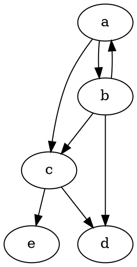
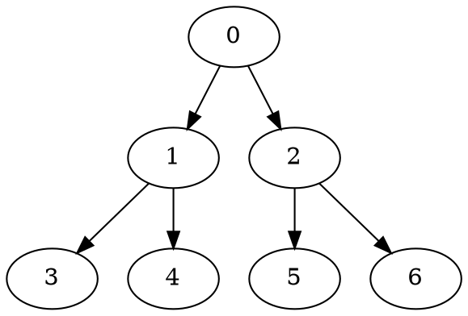
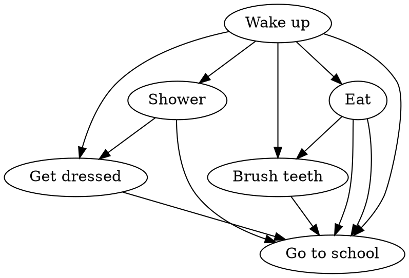

# Graphs {.columns-2}

::::: break-inside-avoid
::: definition
A graph is a set of *vertices* and *edges*.
An *edge* join two vertices.
:::

A graph can be...

directed
: edges have *directions*

acyclic
: graph has no loops

weighted
: edges have weights

::: {.remark title="Applicaions"}
- Building software
- Navigation (Google PageRank, breadcrumbs, etc.)
- Reactive programming
:::


:::::

# Adjacency list {.w-1--2}

::: {.definition title="Adjacency list"}
An *adjacency list* is a dictionary
whose keys are vertices,
and the associated values are a list (or set) of
the end points of the edges starting from that vertex.
:::


``` python
adj = {
    "a": {"b", "c"},
    "b": {"c", "d", "a"},
    "c": {"d", "e"},
    "d": set(),
    "e": set(),
}
```

# Application in software development: reactivity {.grid .grid-cols-2 .gap-8}

~~~ python {.run}
running = []

class State:

    def __init__(self, value):
        self._value = value
        self.subscribers = set()

    @property
    def value(self):
        if running:
            self.subscribers.add(running[-1])
        return self._value

    @value.setter
    def value(self, value):
        self._value = value
        for effect in self.subscribers:
            effect()


class Derived:

    def __init__(self, fn):
        self.fn = fn

    @property
    def value(self):
        return self.fn()

def effect(fn):
    def wrapped():
        running.append(wrapped)
        fn()
        running.pop()
    wrapped()
# --- start
hp = State(100)
doubled = Derived(lambda: hp.value * 2)

@effect
def on_hp_change():
    if hp.value > 20:
        print("You have", hp.value, "HP")
    else:
        print("Careful! Only", hp.value, "HP left")
    print("Doubled value:", doubled.value)


hp.value = 90
hp.value = 70
hp.value = 15
~~~

::::: col
We will show how `State` and `effect` on the next slide.

- **State**: variable that changes over time and that is usually has an impact on the UI.

- **Effect**: function that is run whenever an underlying signal changes.
  Generally used to update the UI.

::: info
- All web frameworks (Angular, Vue, Svelte, Solid, Qwik, etc.) except React
  use this pattern at the core of their reactivity system.

- In a way,
  this is "Excel programming"
:::
:::::

# Demo: Svelte

~~~ javascript {.run framework=svelte}
<script>
  let maxHp = 274
  let hp = $state(274)

  function slap() {
    hp -= 10
  }
  function heal() {
    hp = maxHp
  }
</script>

Pikachu<br />
<progress value={hp} max={maxHp} /><br />
{hp} / {maxHp}<br />
<button onclick={slap}>Slap Pikachu</button>
<button onclick={heal}>Heal Pikachu</button>
{#if hp <= 0}
  <p>You've killed Pikachu. What a monster!</p>
{/if}
~~~

# State Implementation {.grid .grid-cols-2 .gap-8}

~~~ python
running = []
class State:
    def __init__(self, value):
        self._value = value
        self.subscribers = set()

    @property
    def value(self):
        if running:
            self.subscribers.add(running[-1])
        return self._value

    @value.setter
    def value(self, value):
        self._value = value
        for effect in self.subscribers:
            effect()

def effect(fn):
    def wrapped():
        running.append(wrapped)
        fn()
        running.pop()
    wrapped()
~~~

::: break-inside-avoid
- `running`: stack used to keep track of currently running effects.
  Later, we will ensure that effects push themselves onto `running` before running,
  and remove themselves afterwards.

- `self._value`: used to store the current value of the signal.

- `self.subscribers`: set containing the effects that need to be rerun.
  In a way, this is an **adjacency set**.

- L9-13: signal getter.
  If the signal is read inside an effect,
  we add the latter in `self.subscribers`.

- L15-19: signal setter.
  We change the value
  and rerun the dependent effects.

- L22-28: effect decorator.
  We change `fn` so that it pushes itself on and off the `running` stack.
:::

# Graph exploration {.columns-2}

Two approaches are possible:

Breadth-First Search (BFS)
: Starting from a vertex, visit only the immediate neighbours.
  Repeat the procedure to the immediate neighbours.

Depth-First Search (DFS)
: Starting from a vertex, go as far as you can.
  When you're stuck, backtrack.

{.w-full}

# Beadth-First Search {.columns-2}

``` python {.run .break-inside-avoid}
def BFS(adj, start):
    pass

BFS({ 0: {1, 2}, 1: {3, 4}, 2: {5, 6}, 3: set(), 4: set(), 5: set(), 6: set() }, 0)
# --- fragment
import collections

# Complexity: O(V + E)
def BFS(adj, start):
    visited = set()
    queue = collections.deque([start])
    while queue:
        node = queue.popleft()
        print("Visiting", node)
        visited.add(node)
        queue.extend(adj[node] - visited)

BFS({ 0: {1, 2}, 1: {3, 4}, 2: {5, 6}, 3: set(), 4: set(), 5: set(), 6: set() }, 0)
```



# Depth-First Search {.columns-2}

``` python {.run .break-inside-avoid}
def DFS(adj: dict[any, set]):
    pass

DFS({ 0: {1, 2}, 1: {3, 4}, 2: {5, 6}, 3: set(), 4: set(), 5: set(), 6: set() })
# --- fragment
# Complexity: O(V + E)
def DFS(adj: dict[any, set]):
    visited = set()

    def explore(start):
        visited.add(start)
        print("Exploring", start)
        for node in adj[start] - visited:
            explore(node)
        print("Finished exploring", start, ", backtracking")

    for node in adj:
        if node not in visited:
            explore(node)

DFS({ 0: {1, 2}, 1: {3, 4}, 2: {5, 6}, 3: set(), 4: set(), 5: set(), 6: set() })
```


# Lengths of Shortest paths {.w-1--2}

::: exercise
Modify BFS to get the lengths of the shortest path between a source node
and all the other nodes.
:::

If you have time, try to get the path *itself*.

::: hint
For the second part,
use the idea of *parent pointers*.
We try to track the parent node that brought us to the current node.
:::

# Shortest paths: implementation {.grid .grid-cols-2}

::::: break-inside-avoid
``` python {.run hideUntil="2025-11-26 16:15"}
def shortest_paths(adj, start):
    pass

shortest_paths({ 0: {1, 2}, 1: {3, 4}, 2: {5, 6}, 3: set(), 4: set(), 5: set(), 6: set() }, 0)
# --- fragment
# Complexity: O(V + E)
def shortest_paths(adj, start):
    dist = {start: 0}
    queue = [start]
    while queue:
        node = queue.pop(0)
        for neighbour in adj[node]:
            if neighbour not in dist:
                dist[neighbour] = dist[node] + 1
                queue.append(neighbour)
    return dist

shortest_paths({ 0: {1, 2}, 1: {3, 4}, 2: {5, 6}, 3: set(), 4: set(), 5: set(), 6: set() }, 0)
```
:::::

::::: break-inside-avoid

:::::

# Sudoku {.w-1--2}

::: exercise
Write a code that solves any Sudoku grid.
:::

::: hint
- A grid will be represented by an array of 81 integers between `0` and `9`.
  We use `0` to indicate that the entry is empty.
- An edge exists between two grids if they differ by only one number,
  and they both satisfy the sudoku rules (they are not necessarily solvable).
- Explore the graph until you get a solve grid.
  If it's impossible, backtrack.
:::

# Sudoku: implementation {.w-1--2}

``` python {.run hideUntil="2025-11-26 16:15"}
def blacklist(grid: list[int], n: int) -> set[int]:
    """
    For entry n,
    specify which numbers cannot be used,
    because they have been used in the row, column or region.
    """
    return set() 

def solve(grid: list[int]):
    return grid

solve(81*[0])
# --- fragment
def blacklist(grid: list[int], n: int) -> set[int]:
    i, j = n // 9, n % 9
    row = set(grid[9 * i + k] for k in range(9))
    col = set(grid[9 * k + j] for k in range(9))
    i, j = i // 3 * 3, j // 3 * 3
    region = set(grid[9 * (i + di) + (j + dj)] for di in range(3) for dj in range(3))
    return row | col | region - {0}

def solve(grid: list[int]):
    if 0 not in grid:
        return grid
    n = grid.index(0)
    for i in range(1, 10):
        if i not in blacklist(grid, n):
            grid[n] = i
            result = solve(grid)
            if 0 not in result:
                return result
        grid[n] = 0
    return grid

solve(81*[0])
```

# Snakes and Ladders {.columns-2}

::: exercise
Snakes and Ladders is a game played on a 10 x 10 board,
the goal of which is get from square 1 to square 100.
On each turn players will roll a six-sided die and
move forward a number of spaces equal to the result.
If they land on a square that represents a snake or ladder,
they will be transported ahead or behind, respectively,
to a new square. 

Find the smallest number of turns it takes to win.

Part II: find the path itself.
:::


# Snakes and ladders: implementation {.w-1--2}

``` python {.run hideUntil="2025-11-26 16:15"}
snakes = {17: 13, 52: 29, 57: 40, 62: 22, 88: 18, 95: 51, 97: 79}
ladders = {3: 21, 8: 30, 28: 84, 58: 77, 75: 86, 80: 100, 90: 91} 

def minimum_turns(snakes, ladders):
    return 0
# --- fragment
snakes = {17: 13, 52: 29, 57: 40, 62: 22, 88: 18, 95: 51, 97: 79}
ladders = {3: 21, 8: 30, 28: 84, 58: 77, 75: 86, 80: 100, 90: 91} 

def minimum_turns(snakes, ladders):
    visited = set()
    board = { n: n for n in range(0, 101) }
    for start, end in (snakes | ladders).items():
        board[start] = end
    queue = [(0, 0)]
    while queue:
        square, turns = queue.pop(0)
        for move in range(square + 1, square + 7):
            move = board[move]
            if move >= 100:
                return turns + 1
            if move not in visited:
                visited.add(move)
                queue.append((move, turns + 1))

minimum_turns(snakes, ladders)
```


# Topological sort {.w-1--2}

::: exercise
Given a directed graph,
"sort" the vertices in such a way
that the edges are all pointing right.
:::



**Topological sort**: wake up, brush teeth, shower, get dressed, eat, go to school.

::: hint
Run DFS on a graph you can see
and log at the beginning and at the end of an "exploration".
:::

# Topological sort: implementation {.w-1--2}

``` python {.run hideUntil="2025-11-26 16:15"}
def topological_sort(adj: dict[any, set]) -> list:
    return []

topological_sort({ 1: {2}, 0: {1}, 2: {3}, 3: set() })
# --- fragment
# Complexity: O(V + E)
def topological_sort(adj: dict[any, set]) -> list:
    visited = set()
    result = []

    def explore(start):
        visited.add(start)
        for node in adj[start] - visited:
            explore(node)
        result.insert(0, start)

    for node in adj:
        if node not in visited:
            explore(node)
    
    return result

topological_sort({ 1: {2}, 0: {1}, 2: {3}, 3: set() })
```

# Detecting cycles in undirected graphs {.w-1--2}

::: exercise
Given an undirected graph,
determine if it has a cycle (a loop).
:::

# Detecting cycles {.w-1--2}

``` python {.run hideUntil="2025-11-26 16:15"}
def has_cycles(adj: dict[any, set]) -> bool:
    return False
# --- fragment
def has_cycles(adj: dict[any, set]) -> bool:
    visited = set()

    def find_visited(start, parent) -> bool:
        visited.add(start)
        for node in adj[start]:
            if node in visited and parent != node:
                return True
            if node not in visited:
                if find_visited(node, start):
                    return True
        return False

    for node in adj:
        if node not in visited:
            if find_visited(node, None):
                return True
    
    return False
```
